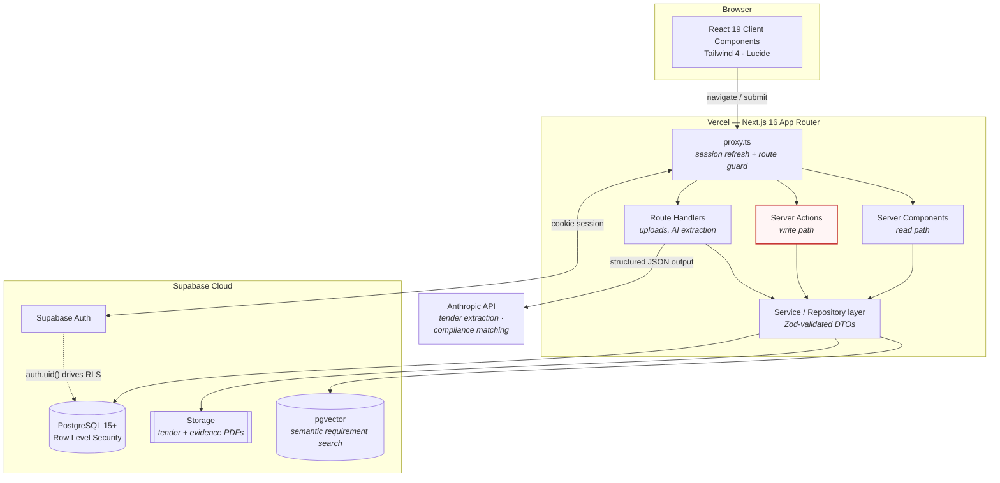

# Architecture — AI Procurement OS V1 MVP

> **Status:** Foundation established at T1.1. The system-context diagram and stack
> constraints below are current. The ER diagram lands with T1.3 (first migration),
> and the ingestion / compliance pipelines with T4.3 and T5.2.

---

## 1. System Context



**Trust boundary:** every database read and write crosses RLS. `auth.uid()` and the
caller's `organization_id` are the only tenancy discriminators — the application layer
never filters by tenant on its own, because a bug there would be a data-leak. RLS is the
enforcement point; the service layer is convenience on top of it.

---

## 2. Repository Layout

```
/
├── src/
│   ├── app/              # Next.js App Router — routes, layouts, route handlers
│   │   ├── globals.css   # Tailwind 4 @theme design tokens (ported from prototype)
│   │   ├── layout.tsx    # Root layout
│   │   └── page.tsx      # T1.1 foundation check (replaced in T2.1)
│   └── lib/
│       ├── env/          # Zod-validated environment, split by trust boundary
│       │   ├── public.ts # NEXT_PUBLIC_* — safe on both sides
│       │   └── server.ts # secret key — `server-only`
│       └── supabase/     # One client per trust level (see §7)
│           ├── client.ts         # browser, publishable key, RLS enforced
│           ├── server.ts         # server, publishable key, RLS enforced
│           ├── admin.ts          # server, secret key, RLS BYPASSED
│           └── database.types.ts # placeholder until T1.3 codegen
├── scripts/
│   └── verify-rls.ts     # live tenant-isolation test (npm run verify:rls)
├── supabase/
│   ├── config.toml       # CLI config
│   └── migrations/       # schema history; push with npm run db:push
├── docs/                 # Living documentation (this directory)
├── v1Prototype/          # FROZEN static prototype — design reference, never edited
└── public/               # Static assets
```

`v1Prototype/index.html` is the source of truth for visual design and is excluded from
ESLint and Prettier. It is a reference, not a build input.

---

## 3. Stack

| Layer                     | Technology              | Version | Notes                                                          |
| ------------------------- | ----------------------- | ------- | -------------------------------------------------------------- |
| Framework                 | Next.js (App Router)    | 16.3.4  | Turbopack is the default bundler                               |
| UI runtime                | React                   | 19.2.8  | App Router pins its own React internally                       |
| Language                  | TypeScript              | 5.9.3   | `strict` + `noUncheckedIndexedAccess`                          |
| Styling                   | Tailwind CSS            | 4.3.3   | CSS-first `@theme`; **no `tailwind.config.js`**                |
| Icons                     | lucide-react            | latest  |                                                                |
| Lint                      | ESLint                  | 9.x     | Flat config; `eslint-config-prettier` last                     |
| Format                    | Prettier                | 3.x     | + `prettier-plugin-tailwindcss` for class sorting              |
| Database / Auth / Storage | Supabase Cloud          | PG 15+  | RLS, pgvector, Storage                                         |
| Supabase SDK              | `@supabase/supabase-js` | 2.116.0 |                                                                |
| Supabase SSR              | `@supabase/ssr`         | 0.12.7  | `getAll`/`setAll` cookie API                                   |
| Validation                | Zod                     | 4.5.4   | `z.url()`, `z.prettifyError()` — Zod 4 API, differs from Zod 3 |
| AI                        | Anthropic API           | —       | See §5                                                         |
| Hosting                   | Vercel + Supabase Cloud | —       |                                                                |

---

## 4. Next.js 16 Constraints (read before writing code)

Next.js 16 removed several APIs that older tutorials and pre-2026 model knowledge still
assume. Authoritative source: `node_modules/next/dist/docs/01-app/02-guides/upgrading/version-16.md`.

| Change                                | Consequence for this project                                                                                                                                                                                                                                                       |
| ------------------------------------- | ---------------------------------------------------------------------------------------------------------------------------------------------------------------------------------------------------------------------------------------------------------------------------------- |
| **`middleware.ts` → `proxy.ts`**      | T1.4 route protection goes in `proxy.ts` with a named `export function proxy(request)`. The `edge` runtime is **not supported** there; `proxy` is always `nodejs` and this is not configurable. Config flags renamed too (`skipMiddlewareUrlNormalize` → `skipProxyUrlNormalize`). |
| **Async Request APIs (hard removal)** | `cookies()`, `headers()`, `draftMode()`, and `params` / `searchParams` **must be awaited**. Synchronous access no longer merely warns — it is gone. This dictates the shape of the Supabase server client in T1.2.                                                                 |
| **Generated route types**             | Use `PageProps<'/route'>`, `LayoutProps<'/route'>`, `RouteContext<'/route'>` (produced by `next typegen`). Do not hand-roll page/layout prop types.                                                                                                                                |
| **Turbopack by default**              | Bundler config belongs under `turbopack` in `next.config.ts`, not `webpack`.                                                                                                                                                                                                       |
| **`next lint` removed**               | Lint via `eslint` directly — `package.json` already does this.                                                                                                                                                                                                                     |

The nodejs-only `proxy` runtime is convenient here: the full `@supabase/ssr` client works
without edge-runtime restrictions.

---

## 5. AI Model Selection

CLAUDE.md §2 names "Claude 3.5 Sonnet / GPT-4o". Both models are past end-of-life and are
superseded. This project targets:

| Use case                                    | Model               | Rationale                                                                                                                    |
| ------------------------------------------- | ------------------- | ---------------------------------------------------------------------------------------------------------------------------- |
| Tender PDF → Digital Twin extraction (T4.3) | **Claude Opus 5**   | Accuracy-critical. A misread closing date or scoring rule invalidates a bid. Native PDF input avoids a separate OCR service. |
| Compliance requirement matching (T5.2)      | **Claude Sonnet 5** | Higher volume, narrower judgements, cheaper per call.                                                                        |

All AI responses are parsed through Zod schemas. No AI output is ever written to the
database unvalidated, and no AI output constitutes an approval — per CLAUDE.md §3, final
sign-off is strictly human (see the approval gate in T7.4).

---

## 6. Design Tokens

Ported verbatim from `v1Prototype/index.html` into `src/app/globals.css` under Tailwind 4's
`@theme`. Status tokens are named for their **compliance meaning**, not their colour, so
components read as domain logic.

| Token group   | Tokens                                                                 | Prototype origin                  |
| ------------- | ---------------------------------------------------------------------- | --------------------------------- |
| Surfaces      | `canvas` `surface` `ink` `ink-muted` `hairline` `rule` `thead` `field` | page bg, cards, borders, tables   |
| Command rail  | `rail` `rail-ink` `rail-ink-muted` `rail-ink-faint` `rail-active`      | fixed navy sidebar                |
| Status pills  | `status-found-*` `status-verify-*` `status-missing-*` `status-info-*`  | `.green` `.yellow` `.red` `.blue` |
| Meters        | `meter-track` `meter-fill`                                             | `.progress`                       |
| Copilot panel | `copilot-bg` `copilot-border`                                          | `.ai`                             |
| Banners       | `alert-bg` `alert-edge` `success-bg` `success-edge`                    | `.alert` `.success`               |
| Action        | `action`                                                               | `button.action`                   |
| Layout        | `spacing-rail` (235px)                                                 | sidebar width                     |

The interface is light-only, matching the prototype. No dark palette is defined —
inventing one would be a redesign, which CLAUDE.md §1.2 forbids.

---

## 7. Supabase Client Topology

Three clients exist, one per trust level. Choosing the wrong one is the most likely way
to introduce a cross-tenant data leak, so the distinction is deliberate.

| Module                       | Key         | Runs        | Acts as        | RLS          |
| ---------------------------- | ----------- | ----------- | -------------- | ------------ |
| `src/lib/supabase/client.ts` | publishable | browser     | signed-in user | **enforced** |
| `src/lib/supabase/server.ts` | publishable | server      | signed-in user | **enforced** |
| `src/lib/supabase/admin.ts`  | secret      | server only | service role   | **BYPASSED** |

Default to the server client. `admin.ts` is for genuine cross-tenant work only —
migrations, scheduled jobs, admin tooling — and every call site must filter by an
`organization_id` derived from the session, never from client input.

### Environment validation

`src/lib/env/` splits the environment by trust boundary:

- `public.ts` — validates `NEXT_PUBLIC_*` with Zod. Safe on both sides. Rejects a value
  that does not start with `sb_publishable_`, which catches the one catastrophic mistake:
  pasting the secret key into a `NEXT_PUBLIC_` variable would inline an RLS-bypassing
  credential into every page of the app.
- `server.ts` — validates the secret key. Begins with `import "server-only"`, so importing
  it from a Client Component is a **build error**, not a runtime surprise. Verified during
  T1.2 by deliberately importing `admin.ts` into a `"use client"` page: the build failed
  with the full import chain.

Both modules validate at import time and throw with a `z.prettifyError` message, so
misconfiguration fails immediately and legibly rather than surfacing as a confusing 401.

### API key format

This project uses Supabase's current key format (`sb_publishable_` / `sb_secret_`), not the
legacy JWT `anon` / `service_role` pair. One consequence to be aware of: publishable keys
cannot introspect the REST schema root (`/rest/v1/`) — that now requires a secret key. This
does not affect table queries.

### Cookie handling

`@supabase/ssr` requires `getAll`/`setAll`; the older `get`/`set`/`remove` triple is
deprecated and misses edge cases that cause random logouts.

`setAll` receives a **second `headers` argument** carrying
`Cache-Control: private, no-cache, no-store, must-revalidate` and friends. These MUST be
applied to any response that writes auth cookies — otherwise a CDN or reverse proxy can
cache one user's session token and serve it to a different user. `proxy.ts` (T1.4) is
responsible for applying them.

The server client swallows the error `setAll` throws inside Server Components, which cannot
mutate cookies. That is safe **only** because `proxy.ts` refreshes sessions per request. If
that proxy is removed, sessions will silently expire early.

## 8. Data Model

Migration: `supabase/migrations/20260908133617_init_organizations_profiles_rbac.sql`.

```mermaid
erDiagram
    AUTH_USERS ||--|| PROFILES : "id (FK, on delete cascade)"
    ORGANIZATIONS ||--o{ PROFILES : "organization_id (FK, on delete restrict)"

    AUTH_USERS {
        uuid id PK "managed by Supabase Auth"
        text email
    }

    ORGANIZATIONS {
        uuid id PK "gen_random_uuid()"
        text name "NOT NULL, non-blank"
        text registration_number "nullable"
        text vat_number "nullable"
        text csd_supplier_number "nullable"
        timestamptz created_at
        timestamptz updated_at "trigger-maintained"
    }

    PROFILES {
        uuid id PK-FK "= auth.users.id"
        uuid organization_id FK "NOT NULL"
        app_role role "NOT NULL, default bid_manager"
        text full_name "nullable"
        timestamptz created_at
        timestamptz updated_at "trigger-maintained"
    }
```

`organizations` is the tenant root. `profiles` is 1:1 with `auth.users` and binds each user to
exactly one organization and one role. `app_role` is an enum:
`bid_manager | pricing_specialist | executive_approver`.

**`profiles.organization_id` is NOT NULL deliberately.** A nullable tenant key invites
`organization_id = NULL` comparisons, which evaluate to NULL rather than false — a classic
way for a policy to silently stop filtering.

### RLS policy matrix

RLS is enabled on both tables. `anon` is granted nothing.

| Table           | SELECT        | INSERT     | UPDATE                                                                               | DELETE     |
| --------------- | ------------- | ---------- | ------------------------------------------------------------------------------------ | ---------- |
| `organizations` | own org only  | **denied** | own org, `bid_manager` or `executive_approver` only, and only the 4 business columns | **denied** |
| `profiles`      | same org only | **denied** | own row only, and only `full_name`                                                   | **denied** |

INSERT and DELETE are denied to all user roles on both tables. That is intentional:
provisioning a profile is how a user would otherwise insert themselves into a rival's
organization. Both are `service_role`-only.

### Anti-escalation, in two layers

The threat is a user promoting themselves to `executive_approver` and approving their own bid.

1. **Column-level `GRANT` (primary).** `authenticated` holds `UPDATE (full_name)` on
   `profiles` — `role` and `organization_id` are not grantable, so the attempt is rejected at
   the privilege layer before RLS is even consulted.
2. **`forbid_self_privilege_change` trigger (defence-in-depth).** Rejects any change to
   `role` or `organization_id` unless `current_user` is `service_role`, `postgres` or
   `supabase_admin`. This exists because a future migration running
   `grant all on public.profiles to authenticated` would silently re-open layer 1.

The trigger is **SECURITY INVOKER** on purpose. As `SECURITY DEFINER` its `current_user`
would resolve to the function owner rather than the caller, so the privileged-role check
would never match and legitimate administrative role changes would all be rejected.

### Session helpers

`public.current_organization_id()` and `public.current_user_role()` are `SECURITY DEFINER`
because a policy on `profiles` that reads `profiles` recurses infinitely; running as the
owner bypasses RLS on the lookup and breaks the cycle. Both carry `SET search_path = ''` —
mandatory on any `SECURITY DEFINER` function, since otherwise a caller can prepend a schema
and hijack an unqualified name into running their own code with the owner's privileges.
Every identifier in those bodies is fully qualified as a result. `EXECUTE` is revoked from
`PUBLIC` and granted only to `authenticated`.

Both return NULL when the caller has no profile, so every policy **fails closed**.

Policies wrap them as `(select fn())` rather than `fn()`, so Postgres evaluates them once per
statement as an InitPlan instead of once per row.

### Verification

`npm run verify:rls` (`scripts/verify-rls.ts`) provisions two organizations with one user
each and asserts tenant isolation over the wire, as those users, through PostgREST. 12/12
passing as of T1.3, including the cases that must fail: self-promotion, self-transfer between
organizations, organization creation, and cross-tenant read and rename.

### Generated types

`npm run db:types` regenerates `src/lib/supabase/database.types.ts` from the live schema.
**Re-run it after every migration.** It is in `.prettierignore`, since reformatting a
generated file just fights the generator.

Verified as enforcing: unknown table names, column types, and enum values. **Not** enforced:
unknown column names inside a `.select("...")` string — supabase-js's select-string parser is
permissive about those, so a typo there fails at runtime, not compile time.

### Not yet built

There is **no path for a new signup to obtain an organization**, because INSERT is denied on
both tables. T1.4 must supply a `SECURITY DEFINER` onboarding RPC that creates an
organization and its first profile in one transaction.

## 9. Pipelines

> **Pending T4.3 / T5.2.** Mermaid sequence diagrams for PDF ingestion → Digital Twin
> extraction, and for the compliance gap engine, will be added with those tasks.

---

## 10. Decision Log

| #   | Decision                                                             | Rationale                                                                                                                                               |
| --- | -------------------------------------------------------------------- | ------------------------------------------------------------------------------------------------------------------------------------------------------- |
| 1   | Next.js app at repo root, not a monorepo                             | Single deployable; monorepo tooling would violate CLAUDE.md §1.1 (do not over-engineer).                                                                |
| 2   | PDF extraction via Next.js Route Handlers, not a Python service      | Anthropic's native PDF input removes the need for a separate OCR stack and a second deploy target. Revisit only if table extraction proves inadequate.  |
| 3   | Anthropic over OpenAI                                                | Listed first in CLAUDE.md §2; native PDF input plus structured output covers Phases 3–4 in one dependency.                                              |
| 4   | System font stack, not Geist                                         | The prototype specifies Arial. A system stack is the faithful port and removes a build-time font fetch.                                                 |
| 5   | RLS as the tenancy enforcement point                                 | Application-layer tenant filtering is one bug away from cross-tenant disclosure of competitors' bid pricing.                                            |
| 6   | One git branch per task                                              | User's explicit choice; keeps `main` deployable and gives a review checkpoint per task.                                                                 |
| 7   | Three separate Supabase clients rather than one configurable factory | The key in use determines whether RLS applies. Making that a parameter would make the most dangerous decision in the system invisible at the call site. |
| 8   | Env validated with Zod at import time, split by trust boundary       | Fails fast and legibly. The split is what lets `server-only` guarantee the secret key cannot be bundled for the browser.                                |
| 9   | `Database` type is a committed placeholder until T1.3                | Keeps the clients generically typed instead of falling back to the library's internal `any`. Replaced by `supabase gen types` once tables exist.        |
| 10  | `profiles.organization_id` NOT NULL                                  | A nullable tenant key produces NULL comparisons that read as "no filter" rather than "no rows".                                                         |
| 11  | INSERT/DELETE denied to all user roles on both tables                | Profile insertion is the obvious route into a rival's organization. Provisioning stays privileged.                                                      |
| 12  | Anti-escalation duplicated across column GRANTs and a trigger        | Layer 1 is silently undone by any future `grant all`. The blast radius — approving your own bid — justifies the redundancy.                             |
