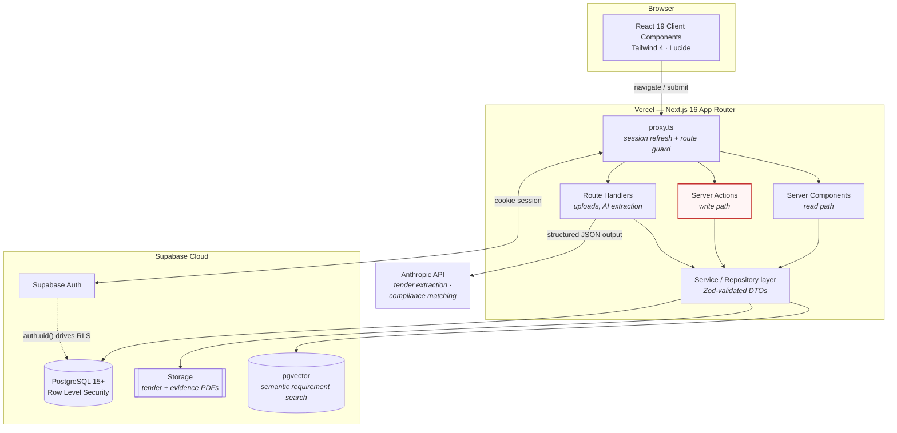

# Architecture — AI Procurement OS V1 MVP

> **Status:** Foundation established at T1.1. The system-context diagram and stack
> constraints below are current. The ER diagram lands with T1.3 (first migration),
> and the ingestion / compliance pipelines with T4.3 and T5.2.

---

## 1. System Context



**Trust boundary:** every database read and write crosses RLS. `auth.uid()` and the
caller's `organization_id` are the only tenancy discriminators — the application layer
never filters by tenant on its own, because a bug there would be a data-leak. RLS is the
enforcement point; the service layer is convenience on top of it.

---

## 2. Repository Layout

```
/
├── src/app/              # Next.js App Router — routes, layouts, route handlers
│   ├── globals.css       # Tailwind 4 @theme design tokens (ported from prototype)
│   ├── layout.tsx        # Root layout
│   └── page.tsx          # T1.1 foundation check (replaced in T2.1)
├── docs/                 # Living documentation (this directory)
├── v1Prototype/          # FROZEN static prototype — design reference, never edited
├── public/               # Static assets
└── supabase/             # Migrations (from T1.3)
```

`v1Prototype/index.html` is the source of truth for visual design and is excluded from
ESLint and Prettier. It is a reference, not a build input.

---

## 3. Stack

| Layer                     | Technology              | Version | Notes                                             |
| ------------------------- | ----------------------- | ------- | ------------------------------------------------- |
| Framework                 | Next.js (App Router)    | 16.3.4  | Turbopack is the default bundler                  |
| UI runtime                | React                   | 19.2.8  | App Router pins its own React internally          |
| Language                  | TypeScript              | 5.9.3   | `strict` + `noUncheckedIndexedAccess`             |
| Styling                   | Tailwind CSS            | 4.3.3   | CSS-first `@theme`; **no `tailwind.config.js`**   |
| Icons                     | lucide-react            | latest  |                                                   |
| Lint                      | ESLint                  | 9.x     | Flat config; `eslint-config-prettier` last        |
| Format                    | Prettier                | 3.x     | + `prettier-plugin-tailwindcss` for class sorting |
| Database / Auth / Storage | Supabase Cloud          | PG 15+  | RLS, pgvector, Storage                            |
| AI                        | Anthropic API           | —       | See §5                                            |
| Hosting                   | Vercel + Supabase Cloud | —       |                                                   |

---

## 4. Next.js 16 Constraints (read before writing code)

Next.js 16 removed several APIs that older tutorials and pre-2026 model knowledge still
assume. Authoritative source: `node_modules/next/dist/docs/01-app/02-guides/upgrading/version-16.md`.

| Change                                | Consequence for this project                                                                                                                                                                                                                                                       |
| ------------------------------------- | ---------------------------------------------------------------------------------------------------------------------------------------------------------------------------------------------------------------------------------------------------------------------------------- |
| **`middleware.ts` → `proxy.ts`**      | T1.4 route protection goes in `proxy.ts` with a named `export function proxy(request)`. The `edge` runtime is **not supported** there; `proxy` is always `nodejs` and this is not configurable. Config flags renamed too (`skipMiddlewareUrlNormalize` → `skipProxyUrlNormalize`). |
| **Async Request APIs (hard removal)** | `cookies()`, `headers()`, `draftMode()`, and `params` / `searchParams` **must be awaited**. Synchronous access no longer merely warns — it is gone. This dictates the shape of the Supabase server client in T1.2.                                                                 |
| **Generated route types**             | Use `PageProps<'/route'>`, `LayoutProps<'/route'>`, `RouteContext<'/route'>` (produced by `next typegen`). Do not hand-roll page/layout prop types.                                                                                                                                |
| **Turbopack by default**              | Bundler config belongs under `turbopack` in `next.config.ts`, not `webpack`.                                                                                                                                                                                                       |
| **`next lint` removed**               | Lint via `eslint` directly — `package.json` already does this.                                                                                                                                                                                                                     |

The nodejs-only `proxy` runtime is convenient here: the full `@supabase/ssr` client works
without edge-runtime restrictions.

---

## 5. AI Model Selection

CLAUDE.md §2 names "Claude 3.5 Sonnet / GPT-4o". Both models are past end-of-life and are
superseded. This project targets:

| Use case                                    | Model               | Rationale                                                                                                                    |
| ------------------------------------------- | ------------------- | ---------------------------------------------------------------------------------------------------------------------------- |
| Tender PDF → Digital Twin extraction (T4.3) | **Claude Opus 5**   | Accuracy-critical. A misread closing date or scoring rule invalidates a bid. Native PDF input avoids a separate OCR service. |
| Compliance requirement matching (T5.2)      | **Claude Sonnet 5** | Higher volume, narrower judgements, cheaper per call.                                                                        |

All AI responses are parsed through Zod schemas. No AI output is ever written to the
database unvalidated, and no AI output constitutes an approval — per CLAUDE.md §3, final
sign-off is strictly human (see the approval gate in T7.4).

---

## 6. Design Tokens

Ported verbatim from `v1Prototype/index.html` into `src/app/globals.css` under Tailwind 4's
`@theme`. Status tokens are named for their **compliance meaning**, not their colour, so
components read as domain logic.

| Token group   | Tokens                                                                 | Prototype origin                  |
| ------------- | ---------------------------------------------------------------------- | --------------------------------- |
| Surfaces      | `canvas` `surface` `ink` `ink-muted` `hairline` `rule` `thead` `field` | page bg, cards, borders, tables   |
| Command rail  | `rail` `rail-ink` `rail-ink-muted` `rail-ink-faint` `rail-active`      | fixed navy sidebar                |
| Status pills  | `status-found-*` `status-verify-*` `status-missing-*` `status-info-*`  | `.green` `.yellow` `.red` `.blue` |
| Meters        | `meter-track` `meter-fill`                                             | `.progress`                       |
| Copilot panel | `copilot-bg` `copilot-border`                                          | `.ai`                             |
| Banners       | `alert-bg` `alert-edge` `success-bg` `success-edge`                    | `.alert` `.success`               |
| Action        | `action`                                                               | `button.action`                   |
| Layout        | `spacing-rail` (235px)                                                 | sidebar width                     |

The interface is light-only, matching the prototype. No dark palette is defined —
inventing one would be a redesign, which CLAUDE.md §1.2 forbids.

---

## 7. Data Model

> **Pending T1.3.** The ER diagram for `organizations`, `profiles` and the RBAC roles
> (`bid_manager`, `pricing_specialist`, `executive_approver`) plus their RLS policies will
> be added here as the first migration is written.

## 8. Pipelines

> **Pending T4.3 / T5.2.** Mermaid sequence diagrams for PDF ingestion → Digital Twin
> extraction, and for the compliance gap engine, will be added with those tasks.

---

## 9. Decision Log

| #   | Decision                                                        | Rationale                                                                                                                                              |
| --- | --------------------------------------------------------------- | ------------------------------------------------------------------------------------------------------------------------------------------------------ |
| 1   | Next.js app at repo root, not a monorepo                        | Single deployable; monorepo tooling would violate CLAUDE.md §1.1 (do not over-engineer).                                                               |
| 2   | PDF extraction via Next.js Route Handlers, not a Python service | Anthropic's native PDF input removes the need for a separate OCR stack and a second deploy target. Revisit only if table extraction proves inadequate. |
| 3   | Anthropic over OpenAI                                           | Listed first in CLAUDE.md §2; native PDF input plus structured output covers Phases 3–4 in one dependency.                                             |
| 4   | System font stack, not Geist                                    | The prototype specifies Arial. A system stack is the faithful port and removes a build-time font fetch.                                                |
| 5   | RLS as the tenancy enforcement point                            | Application-layer tenant filtering is one bug away from cross-tenant disclosure of competitors' bid pricing.                                           |
| 6   | One git branch per task                                         | User's explicit choice; keeps `main` deployable and gives a review checkpoint per task.                                                                |
