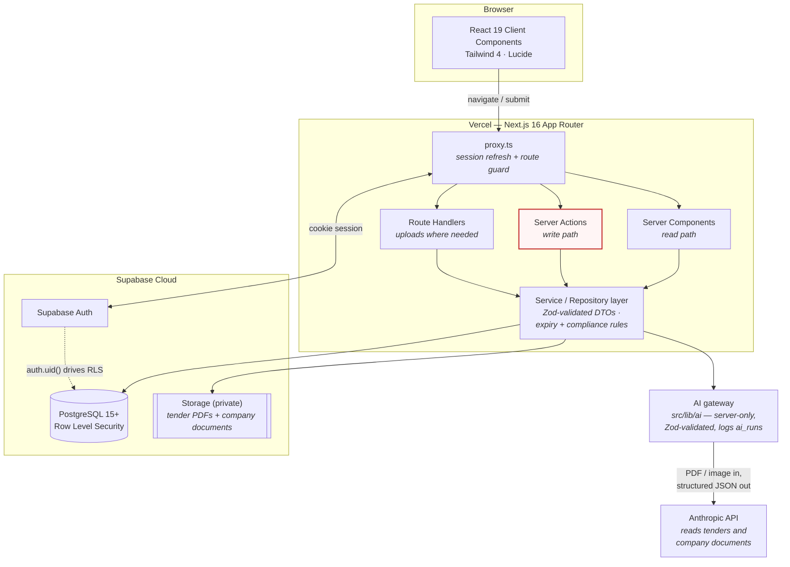

# Architecture — AI Procurement OS, Phase 1: Tender Compliance Checker

> **Status:** E0 foundation done (Next.js, Supabase clients, `organizations`/`profiles` with
> RLS). Phase 1 scope and tickets are in `docs/TASKS.md`. Sections marked _pending_ are
> filled in by the ticket named next to them.

---

## 1. System Context


```mermaid
graph TB
    subgraph client["Browser"]
        UI["React 19 Client Components<br/>Tailwind 4 · Lucide"]
    end

    subgraph vercel["Vercel — Next.js 16 App Router"]
        PROXY["proxy.ts<br/><i>session refresh + route guard</i>"]
        RSC["Server Components<br/><i>read path</i>"]
        SA["Server Actions<br/><i>write path</i>"]
        RH["Route Handlers<br/><i>uploads where needed</i>"]
        SVC["Service / Repository layer<br/><i>Zod-validated DTOs ·<br/>expiry + compliance rules</i>"]
    end

    subgraph supabase["Supabase Cloud"]
        PG[("PostgreSQL 15+<br/>Row Level Security")]
        AUTH["Supabase Auth"]
        STORE[["Storage (private)<br/><i>tender PDFs + company documents</i>"]]
    end

    AI["AI gateway<br/><i>src/lib/ai — server-only,<br/>Zod-validated, logs ai_runs</i>"]
    ANTHROPIC["Anthropic API<br/><i>reads tenders and<br/>company documents</i>"]

    UI -->|"navigate / submit"| PROXY
    PROXY --> RSC
    PROXY --> SA
    PROXY --> RH
    RSC --> SVC
    SA --> SVC
    RH --> SVC
    SVC --> PG
    SVC --> STORE
    PROXY <-->|"cookie session"| AUTH
    AUTH -.->|"auth.uid() drives RLS"| PG
    SVC --> AI
    AI -->|"PDF / image in,<br/>structured JSON out"| ANTHROPIC

    classDef gate fill:#fff5f5,stroke:#c53030,stroke-width:2px
    class SA gate
```

**Trust boundary:** every database read and write crosses RLS. `auth.uid()` and the
caller's `organization_id` are the only tenancy discriminators — the application layer
never filters by tenant on its own, because a bug there would be a data-leak. RLS is the
enforcement point; the service layer is convenience on top of it.

**AI boundary:** AI only _reads_ documents and proposes facts (pending review). Expiry and
compliance statuses are computed by deterministic code from facts a person has confirmed.
pgvector is not used in Phase 1.

---

## 2. Repository Layout

```
/
├── src/
│   ├── app/              # Next.js App Router — routes, layouts, route handlers
│   │   ├── globals.css   # Tailwind 4 @theme tokens (minimal; real set designed in E1.6)
│   │   ├── layout.tsx    # Root layout
│   │   └── page.tsx      # Placeholder (replaced by app shell in E1.7/E1.8)
│   └── lib/
│       ├── env/          # Zod-validated environment, split by trust boundary
│       │   ├── public.ts # NEXT_PUBLIC_* — safe on both sides
│       │   └── server.ts # secret key — `server-only`
│       └── supabase/     # One client per trust level (see §7)
│           ├── client.ts         # browser, publishable key, RLS enforced
│           ├── server.ts         # server, publishable key, RLS enforced
│           ├── admin.ts          # server, secret key, RLS BYPASSED
│           └── database.types.ts # generated by npm run db:types
├── scripts/
│   └── verify-rls.ts     # live tenant-isolation test (npm run verify:rls)
├── supabase/
│   ├── config.toml       # CLI config
│   └── migrations/       # schema history; push with npm run db:push
├── docs/                 # Living documentation (this directory)
├── fixtures/private/     # Real client documents — gitignored, never committed
├── .claude/skills/       # Vendored Claude skills (see its README)
└── public/               # Static assets
```

Planned in Phase 1: `src/lib/ai/` (AI gateway, E2.3), `tests/e2e/` (Playwright, E1.2),
`proxy.ts` (route protection, E1.3).

---

## 3. Stack

| Layer                     | Technology              | Version | Notes                                                          |
| ------------------------- | ----------------------- | ------- | -------------------------------------------------------------- |
| Framework                 | Next.js (App Router)    | 16.3.4  | Turbopack is the default bundler                               |
| UI runtime                | React                   | 19.2.8  | App Router pins its own React internally                       |
| Language                  | TypeScript              | 5.9.3   | `strict` + `noUncheckedIndexedAccess`                          |
| Styling                   | Tailwind CSS            | 4.3.3   | CSS-first `@theme`; **no `tailwind.config.js`**                |
| Icons                     | lucide-react            | latest  |                                                                |
| Lint                      | ESLint                  | 9.x     | Flat config; `eslint-config-prettier` last                     |
| Format                    | Prettier                | 3.x     | + `prettier-plugin-tailwindcss` for class sorting              |
| Database / Auth / Storage | Supabase Cloud          | PG 15+  | RLS, Auth, private Storage                                     |
| Supabase SDK              | `@supabase/supabase-js` | 2.116.0 |                                                                |
| Supabase SSR              | `@supabase/ssr`         | 0.12.7  | `getAll`/`setAll` cookie API                                   |
| Validation                | Zod                     | 4.5.4   | `z.url()`, `z.prettifyError()` — Zod 4 API, differs from Zod 3 |
| AI                        | Anthropic API           | —       | `claude-opus-5-5` via the AI gateway; see §5                   |
| Hosting                   | Vercel + Supabase Cloud | —       |                                                                |

---

## 4. Next.js 16 Constraints (read before writing code)

Next.js 16 removed several APIs that older tutorials and pre-2026 model knowledge still
assume. Authoritative source: `node_modules/next/dist/docs/01-app/02-guides/upgrading/version-16.md`.

| Change                                | Consequence for this project                                                                                                                                                                                                                                                       |
| ------------------------------------- | ---------------------------------------------------------------------------------------------------------------------------------------------------------------------------------------------------------------------------------------------------------------------------------- |
| **`middleware.ts` → `proxy.ts`**      | E1.3 route protection goes in `proxy.ts` with a named `export function proxy(request)`. The `edge` runtime is **not supported** there; `proxy` is always `nodejs` and this is not configurable. Config flags renamed too (`skipMiddlewareUrlNormalize` → `skipProxyUrlNormalize`). |
| **Async Request APIs (hard removal)** | `cookies()`, `headers()`, `draftMode()`, and `params` / `searchParams` **must be awaited**. Synchronous access no longer merely warns — it is gone. This dictates the shape of the Supabase server client (T1.2).                                                                  |
| **Generated route types**             | Use `PageProps<'/route'>`, `LayoutProps<'/route'>`, `RouteContext<'/route'>` (produced by `next typegen`). Do not hand-roll page/layout prop types.                                                                                                                                |
| **Turbopack by default**              | Bundler config belongs under `turbopack` in `next.config.ts`, not `webpack`.                                                                                                                                                                                                       |
| **`next lint` removed**               | Lint via `eslint` directly — `package.json` already does this.                                                                                                                                                                                                                     |

The nodejs-only `proxy` runtime is convenient here: the full `@supabase/ssr` client works
without edge-runtime restrictions.

---

## 5. AI Model Selection

| Use case                                                     | Model                         | Ticket | Rationale                                                                                                                                        |
| ------------------------------------------------------------ | ----------------------------- | ------ | ------------------------------------------------------------------------------------------------------------------------------------------------ |
| Company document reading (type, dates, certification stamps) | **Claude Opus 5.5**           | E2.4   | Reads scanned PDFs and photos natively, including rubber-stamp dates. A misread date flips a document between valid and expired.                 |
| Tender reading (key facts, returnables, validity rules)      | **Claude Opus 5.5**           | E3.3   | Accuracy-critical: a misread closing date or returnable list costs a bid. Native PDF input avoids a separate OCR service.                        |
| Compliance matching and conflict checks                      | **None — deterministic code** | E4.1–2 | Predictable, testable, free to run, and explainable to the client. AI suggests requirement-to-category mappings only when a lookup has no match. |

Rules: every call goes through the AI gateway (`src/lib/ai/`, E2.3) and is logged in
`ai_runs`. Responses are parsed with Zod; nothing unvalidated reaches the database. AI output
is saved as _pending review_ and never constitutes an approval. Cost: roughly R5–R20 per
30-page tender at current Opus 5.5 rates ($4 / $20 per million input / output tokens).

---

## 6. Design Tokens

_Pending E1.6._ The old prototype and its palette were removed. `src/app/globals.css`
currently holds only a neutral base and the system font stack. E1.6 defines the token set
following CLAUDE.md §1.2: neutral surfaces, one accent, and status tokens named for their
meaning — `compliant`, `expiring`, `expired`, `missing`, `conflict`, `needs-verification`,
`unable-to-verify` — plus a single `StatusPill` component.

---

## 7. Supabase Client Topology

Three clients exist, one per trust level. Choosing the wrong one is the most likely way
to introduce a cross-tenant data leak, so the distinction is deliberate.

| Module                       | Key         | Runs        | Acts as        | RLS          |
| ---------------------------- | ----------- | ----------- | -------------- | ------------ |
| `src/lib/supabase/client.ts` | publishable | browser     | signed-in user | **enforced** |
| `src/lib/supabase/server.ts` | publishable | server      | signed-in user | **enforced** |
| `src/lib/supabase/admin.ts`  | secret      | server only | service role   | **BYPASSED** |

Default to the server client. `admin.ts` is for genuine cross-tenant work only —
migrations, scheduled jobs, admin tooling — and every call site must filter by an
`organization_id` derived from the session, never from client input.

### Environment validation

`src/lib/env/` splits the environment by trust boundary:

- `public.ts` — validates `NEXT_PUBLIC_*` with Zod. Safe on both sides. Rejects a value
  that does not start with `sb_publishable_`, which catches the one catastrophic mistake:
  pasting the secret key into a `NEXT_PUBLIC_` variable would inline an RLS-bypassing
  credential into every page of the app.
- `server.ts` — validates the secret key. Begins with `import "server-only"`, so importing
  it from a Client Component is a **build error**, not a runtime surprise. Verified during
  T1.2 by deliberately importing `admin.ts` into a `"use client"` page: the build failed
  with the full import chain.

Both modules validate at import time and throw with a `z.prettifyError` message, so
misconfiguration fails immediately and legibly rather than surfacing as a confusing 401.

### API key format

This project uses Supabase's current key format (`sb_publishable_` / `sb_secret_`), not the
legacy JWT `anon` / `service_role` pair. One consequence to be aware of: publishable keys
cannot introspect the REST schema root (`/rest/v1/`) — that now requires a secret key. This
does not affect table queries.

### Cookie handling

`@supabase/ssr` requires `getAll`/`setAll`; the older `get`/`set`/`remove` triple is
deprecated and misses edge cases that cause random logouts.

`setAll` receives a **second `headers` argument** carrying
`Cache-Control: private, no-cache, no-store, must-revalidate` and friends. These MUST be
applied to any response that writes auth cookies — otherwise a CDN or reverse proxy can
cache one user's session token and serve it to a different user. `proxy.ts` (E1.3) is
responsible for applying them.

The server client swallows the error `setAll` throws inside Server Components, which cannot
mutate cookies. That is safe **only** because `proxy.ts` refreshes sessions per request. If
that proxy is removed, sessions will silently expire early.

## 8. Data Model

Migration: `supabase/migrations/20260908133617_init_organizations_profiles_rbac.sql`.

```mermaid
erDiagram
    AUTH_USERS ||--|| PROFILES : "id (FK, on delete cascade)"
    ORGANIZATIONS ||--o{ PROFILES : "organization_id (FK, on delete restrict)"

    AUTH_USERS {
        uuid id PK "managed by Supabase Auth"
        text email
    }

    ORGANIZATIONS {
        uuid id PK "gen_random_uuid()"
        text name "NOT NULL, non-blank"
        text registration_number "nullable"
        text vat_number "nullable"
        text csd_supplier_number "nullable"
        timestamptz created_at
        timestamptz updated_at "trigger-maintained"
    }

    PROFILES {
        uuid id PK-FK "= auth.users.id"
        uuid organization_id FK "NOT NULL"
        app_role role "NOT NULL, default bid_manager"
        text full_name "nullable"
        timestamptz created_at
        timestamptz updated_at "trigger-maintained"
    }
```

`organizations` is the tenant root. `profiles` is 1:1 with `auth.users` and binds each user to
exactly one organization and one role. `app_role` is an enum:
`bid_manager | pricing_specialist | executive_approver`.

**`profiles.organization_id` is NOT NULL deliberately.** A nullable tenant key invites
`organization_id = NULL` comparisons, which evaluate to NULL rather than false — a classic
way for a policy to silently stop filtering.

### RLS policy matrix

RLS is enabled on both tables. `anon` is granted nothing.

| Table           | SELECT        | INSERT     | UPDATE                                                                               | DELETE     |
| --------------- | ------------- | ---------- | ------------------------------------------------------------------------------------ | ---------- |
| `organizations` | own org only  | **denied** | own org, `bid_manager` or `executive_approver` only, and only the 4 business columns | **denied** |
| `profiles`      | same org only | **denied** | own row only, and only `full_name`                                                   | **denied** |

INSERT and DELETE are denied to all user roles on both tables. That is intentional:
provisioning a profile is how a user would otherwise insert themselves into a rival's
organization. Both are `service_role`-only.

### Anti-escalation, in two layers

The threat is a user promoting themselves to `executive_approver` and approving their own bid.

1. **Column-level `GRANT` (primary).** `authenticated` holds `UPDATE (full_name)` on
   `profiles` — `role` and `organization_id` are not grantable, so the attempt is rejected at
   the privilege layer before RLS is even consulted.
2. **`forbid_self_privilege_change` trigger (defence-in-depth).** Rejects any change to
   `role` or `organization_id` unless `current_user` is `service_role`, `postgres` or
   `supabase_admin`. This exists because a future migration running
   `grant all on public.profiles to authenticated` would silently re-open layer 1.

The trigger is **SECURITY INVOKER** on purpose. As `SECURITY DEFINER` its `current_user`
would resolve to the function owner rather than the caller, so the privileged-role check
would never match and legitimate administrative role changes would all be rejected.

### Session helpers

`public.current_organization_id()` and `public.current_user_role()` are `SECURITY DEFINER`
because a policy on `profiles` that reads `profiles` recurses infinitely; running as the
owner bypasses RLS on the lookup and breaks the cycle. Both carry `SET search_path = ''` —
mandatory on any `SECURITY DEFINER` function, since otherwise a caller can prepend a schema
and hijack an unqualified name into running their own code with the owner's privileges.
Every identifier in those bodies is fully qualified as a result. `EXECUTE` is revoked from
`PUBLIC` and granted only to `authenticated`.

Both return NULL when the caller has no profile, so every policy **fails closed**.

Policies wrap them as `(select fn())` rather than `fn()`, so Postgres evaluates them once per
statement as an InitPlan instead of once per row.

### Verification

`npm run verify:rls` (`scripts/verify-rls.ts`) provisions two organizations with one user
each and asserts tenant isolation over the wire, as those users, through PostgREST. 12/12
passing as of T1.3, including the cases that must fail: self-promotion, self-transfer between
organizations, organization creation, and cross-tenant read and rename.

### Generated types

`npm run db:types` regenerates `src/lib/supabase/database.types.ts` from the live schema.
**Re-run it after every migration.** It is in `.prettierignore`, since reformatting a
generated file just fights the generator.

Verified as enforcing: unknown table names, column types, and enum values. **Not** enforced:
unknown column names inside a `.select("...")` string — supabase-js's select-string parser is
permissive about those, so a typo there fails at runtime, not compile time.

### Not yet built

There is **no path for a new signup to obtain an organization**, because INSERT is denied on
both tables. E1.4 supplies a `SECURITY DEFINER` onboarding function (in a non-exposed schema,
with an `auth.uid()` check) that creates an organization and its first profile in one
transaction.

Planned tables, each added with RLS and `verify:rls` coverage in its ticket:
`audit_events` (E1.5) · `company_documents`, `ai_runs` and validity settings on
`organizations` (E2.1) · `tenders`, `tender_documents`, `tender_requirements` (E3.1).
Compliance results are computed on read in Phase 1, so there is no results table.

The three roles (`bid_manager`, `pricing_specialist`, `executive_approver`) are kept for
Phase 1; the booklet's larger role set is a later-phase decision.

## 9. Pipelines

> _Pending._ Mermaid diagrams are added by the tickets that build each pipeline.

| Pipeline                                                                       | Built in  |
| ------------------------------------------------------------------------------ | --------- |
| Company document: upload → hash → store → AI read → human review → status      | E2.2–E2.6 |
| Tender: upload → store → AI read → requirement mapping → human review          | E3.2–E3.5 |
| Compliance: requirements × confirmed documents → statuses + conflicts → report | E4.1–E4.4 |

---

## 10. Decision Log

| #   | Decision                                                             | Rationale                                                                                                                                               |
| --- | -------------------------------------------------------------------- | ------------------------------------------------------------------------------------------------------------------------------------------------------- |
| 1   | Next.js app at repo root, not a monorepo                             | Single deployable; monorepo tooling would violate CLAUDE.md §1.1 (do not over-engineer).                                                                |
| 2   | PDF extraction via Next.js Route Handlers, not a Python service      | Anthropic's native PDF input removes the need for a separate OCR stack and a second deploy target. Revisit only if table extraction proves inadequate.  |
| 3   | Anthropic over OpenAI                                                | Native PDF and image input plus structured output covers document and tender reading in one dependency.                                                 |
| 4   | System font stack, not Geist                                         | No build-time font fetch. Revisited in E1.6 when the design system is defined.                                                                          |
| 5   | RLS as the tenancy enforcement point                                 | Application-layer tenant filtering is one bug away from cross-tenant disclosure of competitors' bid pricing.                                            |
| 6   | One git branch per task                                              | User's explicit choice; keeps `main` deployable and gives a review checkpoint per task.                                                                 |
| 7   | Three separate Supabase clients rather than one configurable factory | The key in use determines whether RLS applies. Making that a parameter would make the most dangerous decision in the system invisible at the call site. |
| 8   | Env validated with Zod at import time, split by trust boundary       | Fails fast and legibly. The split is what lets `server-only` guarantee the secret key cannot be bundled for the browser.                                |
| 9   | `Database` type is a committed placeholder until T1.3                | Keeps the clients generically typed instead of falling back to the library's internal `any`. Replaced by `supabase gen types` once tables exist.        |
| 10  | `profiles.organization_id` NOT NULL                                  | A nullable tenant key produces NULL comparisons that read as "no filter" rather than "no rows".                                                         |
| 11  | INSERT/DELETE denied to all user roles on both tables                | Profile insertion is the obvious route into a rival's organization. Provisioning stays privileged.                                                      |
| 12  | Anti-escalation duplicated across column GRANTs and a trigger        | Layer 1 is silently undone by any future `grant all`. The blast radius — approving your own bid — justifies the redundancy.                             |
| 13  | Phase 1 narrowed to a tender compliance checker                      | Client's booklet has 45 builds; the quote covers five milestones ending 13 Nov 2026. Later phases are listed in `docs/TASKS.md`.                        |
| 14  | Old static prototype deleted; UI designed fresh                      | Client's reference is a minimal work-management tool. Porting the prototype would carry its look and its out-of-scope screens.                          |
| 15  | Client's earlier Python/FastAPI builds not used                      | About 350 lines of real logic, main build crashes on import, no auth or migrations. Ideas (statuses, never-infer rules) carried over; code not.         |
| 16  | Compliance matching is deterministic code, not AI                    | Predictable, unit-testable, free to run and explainable. AI is limited to reading documents.                                                            |
| 17  | Claude Opus 5.5 through a single AI gateway                          | One place for model choice, Zod validation, cost logging and provider changes (booklet: "keep model providers behind an AI gateway").                   |
| 18  | Third-party Claude skills vendored into `.claude/skills/`            | Read before adding; pinned versions; web-design-guidelines saved locally instead of fetched at runtime.                                                 |
