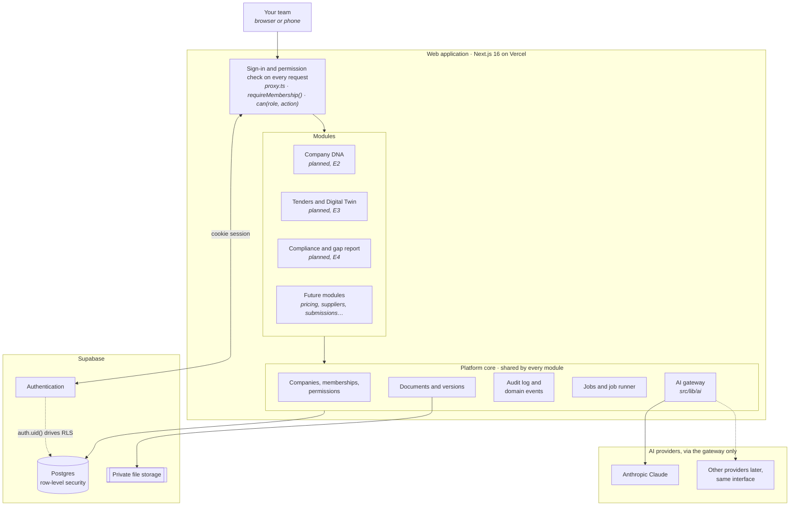
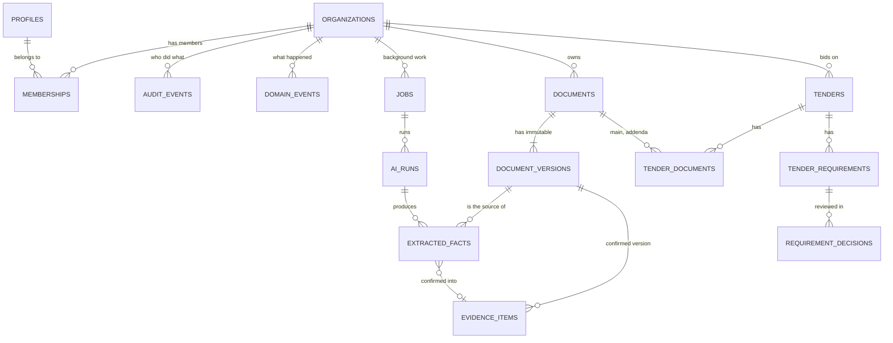
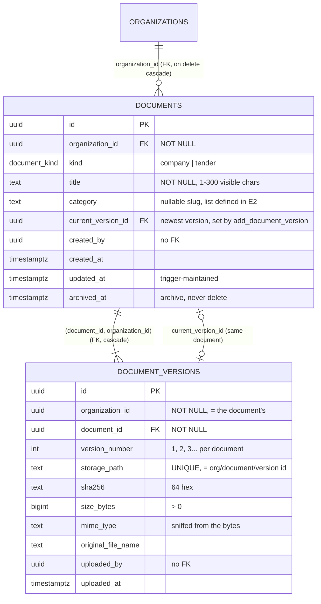

# Architecture — AI Procurement OS

> **Status:** Phase 1 is the **first production module** of the AI Procurement OS, not a
> standalone compliance app. It is built on a platform core (tenancy, memberships,
> permissions, audit, versioned documents, events and jobs, AI gateway) that every later
> module reuses. This document follows the architecture and roadmap sent to the client on
> 8 Oct 2026 (`AI_Procurement_OS_Architecture_and_Roadmap.pdf`; the client's approval is
> pending). Tickets are in `docs/TASKS.md`, whose **Architecture rules** apply to every
> ticket. Only what exists in the code is marked _built_; everything else is _planned_,
> with the ticket that builds it.

---

## 1. System Context

One web application (Next.js on Vercel) and one database platform (Supabase). Modules sit
on a shared platform core. There are no separate services to host, which keeps running
costs low and leaves room to add a queue or a second service later if volume demands it.


```mermaid
graph TB
    TEAM["Your team<br/><i>browser or phone</i>"]

    subgraph vercel["Web application · Next.js 16 on Vercel"]
        GATE["Sign-in and permission check on every request<br/><i>proxy.ts · requireMembership() · can(role, action)</i>"]
        subgraph modules["Modules"]
            DNA["Company DNA<br/><i>planned, E2</i>"]
            TWIN["Tenders and Digital Twin<br/><i>planned, E3</i>"]
            COMP["Compliance and gap report<br/><i>planned, E4</i>"]
            FUT["Future modules<br/><i>pricing, suppliers, submissions…</i>"]
        end
        subgraph core["Platform core · shared by every module"]
            TEN["Companies, memberships,<br/>permissions"]
            DOCS["Documents and versions"]
            LOG["Audit log and<br/>domain events"]
            JOBS["Jobs and job runner"]
            GW["AI gateway<br/><i>src/lib/ai</i>"]
        end
    end

    subgraph supabase["Supabase"]
        PG[("Postgres<br/>row-level security")]
        AUTH["Authentication"]
        STORE[["Private file storage"]]
    end

    subgraph providers["AI providers, via the gateway only"]
        ANTHROPIC["Anthropic Claude"]
        OTHER["Other providers later,<br/>same interface"]
    end

    TEAM --> GATE
    GATE <-->|"cookie session"| AUTH
    GATE --> modules
    modules --> core
    core --> PG
    DOCS --> STORE
    AUTH -.->|"auth.uid() drives RLS"| PG
    GW --> ANTHROPIC
    GW -.-> OTHER
```

Inside the app, Server Components are the read path, Server Actions the write path, and
Route Handlers are used only for uploads, the job runner and AI work where needed.

| Platform core part                  | Status                                                                                  |
| ----------------------------------- | --------------------------------------------------------------------------------------- |
| Companies, memberships, permissions | Companies, memberships and the permission matrix **built** (T1.3, E1.4, E1.5.2, E1.5.3) |
| Documents and versions              | **Built** (E1.5.4)                                                                      |
| Audit log and domain events         | **Built** (E1 ticket E1.5; E1.5.5)                                                      |
| Jobs and job runner                 | **Built** (E1.5.5)                                                                      |
| AI gateway                          | **Built** (E1.5.6)                                                                      |

**Trust boundary:** every database read and write crosses RLS. `auth.uid()` and the
caller's `organization_id` are the only tenancy discriminators — the application layer
never filters by tenant on its own, because a bug there would be a data-leak. RLS is the
enforcement point; the service layer is convenience on top of it.

**How AI work runs** (from E2 on):

1. A person uploads a tender or document. The file is hashed and stored unchanged.
2. A job is queued. The job runner calls the AI gateway, which reads the file and returns
   structured facts.
3. Facts are saved as _pending review_, each with page, quote and confidence.
4. A person confirms or corrects them. Only confirmed facts feed compliance.

**What AI is not allowed to do:** decide a compliance status (rules in code do that, from
confirmed facts); guess a missing value (it returns "not found"); claim a stamp or document
is genuine; apply a rule the tender does not state; approve anything. Every material
decision is a person's, and is logged. pgvector is not used in Phase 1.

---

## 2. Repository Layout

```
/
├── src/
│   ├── proxy.ts          # session refresh + route guard (Next 16's middleware)
│   ├── app/              # Next.js App Router — routes, layouts, route handlers
│   │   ├── (auth)/       # /login, /signup, /forgot-password, /reset-password, /onboarding
│   │   ├── (app)/        # workspace: / (dashboard), /tenders, /documents, /settings
│   │   ├── auth/callback/ # landing route for auth email links
│   │   ├── globals.css   # Tailwind 4 @theme design + status tokens (§6)
│   │   ├── layout.tsx    # Root layout
│   ├── components/       # shell/, ui/ (StatusPill), forms/, auth/, workspace/, dashboard/, tenders/
│   └── lib/
│       ├── audit/        # recordAuditEvent — the one audit write path
│       ├── auth/         # Server Actions, Zod schemas, session helpers, path rules
│       ├── compliance/   # status set (statuses.ts); engines arrive in E2.5/E4.1
│       ├── tenders/      # tender stages (board columns; E3.1 enum)
│       ├── workspace/    # membership (profile + organization), onboarding action
│       ├── env/          # Zod-validated environment, split by trust boundary
│       │   ├── public.ts # NEXT_PUBLIC_* — safe on both sides
│       │   └── server.ts # secret key — `server-only`
│       └── supabase/     # One client per trust level (see §7)
│           ├── client.ts         # browser, publishable key, RLS enforced
│           ├── server.ts         # server, publishable key, RLS enforced
│           ├── admin.ts          # server, secret key, RLS BYPASSED
│           ├── proxy.ts          # updateSession() used by src/proxy.ts
│           └── database.types.ts # generated by npm run db:types
├── scripts/
│   └── verify-rls.ts     # live tenant-isolation test (npm run verify:rls)
├── tests/e2e/            # Playwright user journeys (npm run test:e2e)
├── tests/unit/           # node --test, pure logic (npm run test:unit)
├── playwright.config.ts  # Chromium only; builds and runs `next start` on :3100
├── supabase/
│   ├── config.toml       # CLI config
│   └── migrations/       # schema history; push with npm run db:push
├── docs/                 # Living documentation (this directory)
├── fixtures/private/     # Real client documents — gitignored, never committed
├── .claude/skills/       # Vendored Claude skills (see its README)
└── public/               # Static assets
```

Built in E1.5: `src/lib/auth/permissions.ts` (permission matrix, E1.5.3), `src/lib/documents/`
(documents and versions, E1.5.4), `src/lib/jobs/` (domain events, jobs and the job
runner, E1.5.5), `src/app/api/jobs/run/` (runner route), `src/lib/ai/` (AI gateway,
E1.5.6), `tests/live/` (opt-in live AI test).

---

## 3. Stack

| Layer                     | Technology              | Version | Notes                                                          |
| ------------------------- | ----------------------- | ------- | -------------------------------------------------------------- |
| Framework                 | Next.js (App Router)    | 16.3.4  | Turbopack is the default bundler                               |
| UI runtime                | React                   | 19.2.8  | App Router pins its own React internally                       |
| Language                  | TypeScript              | 5.9.3   | `strict` + `noUncheckedIndexedAccess`                          |
| Styling                   | Tailwind CSS            | 4.3.3   | CSS-first `@theme`; **no `tailwind.config.js`**                |
| Icons                     | lucide-react            | latest  |                                                                |
| Lint                      | ESLint                  | 9.x     | Flat config; `eslint-config-prettier` last                     |
| Format                    | Prettier                | 3.x     | + `prettier-plugin-tailwindcss` for class sorting              |
| Database / Auth / Storage | Supabase Cloud          | PG 15+  | RLS, Auth, private Storage                                     |
| Supabase SDK              | `@supabase/supabase-js` | 2.116.0 |                                                                |
| Supabase SSR              | `@supabase/ssr`         | 0.12.7  | `getAll`/`setAll` cookie API                                   |
| Validation                | Zod                     | 4.5.4   | `z.url()`, `z.prettifyError()` — Zod 4 API, differs from Zod 3 |
| AI                        | Anthropic API           | —       | `claude-opus-5-5` via the AI gateway; see §5                   |
| E2E tests                 | `@playwright/test`      | 1.64.0  | Chromium only; `PLAYWRIGHT_BASE_URL` targets a deployment      |
| Hosting                   | Vercel + Supabase Cloud | —       |                                                                |

---

## 4. Next.js 16 Constraints (read before writing code)

Next.js 16 removed several APIs that older tutorials and pre-2026 model knowledge still
assume. Authoritative source: `node_modules/next/dist/docs/01-app/02-guides/upgrading/version-16.md`.

| Change                                | Consequence for this project                                                                                                                                                                                                                                                       |
| ------------------------------------- | ---------------------------------------------------------------------------------------------------------------------------------------------------------------------------------------------------------------------------------------------------------------------------------- |
| **`middleware.ts` → `proxy.ts`**      | E1.3 route protection goes in `proxy.ts` with a named `export function proxy(request)`. The `edge` runtime is **not supported** there; `proxy` is always `nodejs` and this is not configurable. Config flags renamed too (`skipMiddlewareUrlNormalize` → `skipProxyUrlNormalize`). |
| **Async Request APIs (hard removal)** | `cookies()`, `headers()`, `draftMode()`, and `params` / `searchParams` **must be awaited**. Synchronous access no longer merely warns — it is gone. This dictates the shape of the Supabase server client (T1.2).                                                                  |
| **Generated route types**             | Use `PageProps<'/route'>`, `LayoutProps<'/route'>`, `RouteContext<'/route'>` (produced by `next typegen`). Do not hand-roll page/layout prop types.                                                                                                                                |
| **Turbopack by default**              | Bundler config belongs under `turbopack` in `next.config.ts`, not `webpack`.                                                                                                                                                                                                       |
| **`next lint` removed**               | Lint via `eslint` directly — `package.json` already does this.                                                                                                                                                                                                                     |

The nodejs-only `proxy` runtime is convenient here: the full `@supabase/ssr` client works
without edge-runtime restrictions.

---

## 5. AI Model Selection

| Use case                                                     | Model                         | Ticket | Rationale                                                                                                                                        |
| ------------------------------------------------------------ | ----------------------------- | ------ | ------------------------------------------------------------------------------------------------------------------------------------------------ |
| Company document reading (type, dates, certification stamps) | **Claude Opus 5.5**           | E2.3   | Reads scanned PDFs and photos natively, including rubber-stamp dates. A misread date flips a document between valid and expired.                 |
| Tender reading (key facts, returnables, stated rules)        | **Claude Opus 5.5**           | E3.3   | Accuracy-critical: a misread closing date or returnable list costs a bid. Native PDF input avoids a separate OCR service.                        |
| Compliance matching and conflict checks                      | **None — deterministic code** | E4.2–3 | Predictable, testable, free to run, and explainable to the client. AI suggests requirement-to-category mappings only when a lookup has no match. |

Model facts checked against the `claude-api` skill on 2026-10-08: `claude-opus-5-5`, $4 / $20
per million input / output tokens (cache reads $0.20), 1M-token context, native PDF input
(base64 document block, up to 32 MB and 600 pages) and images. Things E2.3 must know:
thinking cannot be disabled (control depth with `output_config.effort`, whose default on
this model is `medium`, so set it explicitly); forced `tool_choice` (`any`/`tool`) returns
a 400, so get JSON back through structured outputs (`output_config.format`) and validate it
with Zod anyway; no assistant prefill; check `stop_reason` for `refusal` before reading the
content. The gateway below does all of this.

Rules: every call goes through the provider-neutral AI gateway (`src/lib/ai/`, E1.5.6) and
is logged in `ai_runs`; no other file imports a provider SDK. Responses are parsed with Zod; nothing unvalidated reaches the database. AI output
is saved as _pending review_ and never constitutes an approval. Cost: roughly R5–R20 per
30-page tender at current Opus 5.5 rates ($4 / $20 per million input / output tokens).

### AI gateway (built in E1.5.6)

Every AI call goes through `src/lib/ai/` (Architecture rule 6). An ESLint rule
(`no-restricted-imports`, checked by `tests/unit/ai-boundary.test.ts`) refuses the Anthropic
SDK in every file except the adapter.

```text
caller (job handler, E2.3/E3.3)
  └─ runAiTask({ task, organizationId, jobId?, actorId?, instructions, prompt, files?, output: ZodSchema })
       src/lib/ai/index.ts     server only: configured providers + ai_runs log
       src/lib/ai/gateway.ts   route → provider.generate (timeout) → JSON → Zod → log → result
       src/lib/ai/config.ts    task → provider, model, effort, max output tokens, timeout; prices
       src/lib/ai/types.ts     provider-neutral AiProvider interface, AiError
       src/lib/ai/providers/anthropic.ts   the only SDK import (@anthropic-ai/sdk 0.132.1)
       src/lib/ai/providers/fake.ts        used by every test; never calls a model
       src/lib/ai/log.ts       ai_runs writer (service role)
```

| Task                           | Model             | Effort | Max output | Timeout | Built in |
| ------------------------------ | ----------------- | ------ | ---------- | ------- | -------- |
| `connectivity_check`           | `claude-opus-5-5` | low    | 2,000      | 60 s    | E1.5.6   |
| `read_company_document`        | `claude-opus-5-5` | high   | 16,000     | 170 s   | E2.3     |
| `read_tender`                  | `claude-opus-5-5` | high   | 32,000     | 170 s   | E3.3     |
| `suggest_requirement_category` | `claude-opus-5-5` | low    | 2,000      | 60 s    | E3.4     |

Timeouts stay below the job runner's 200 s budget; a job handler's own timeout must be
longer than its task's. The reading tasks' effort and limits are tuned in their tickets.

**Anthropic adapter.** Streams the request (`finalMessage()`), sends files as base64 PDF or
image blocks, sets `output_config.effort` explicitly (Opus 5.5 defaults to `medium` and its
thinking cannot be disabled), asks for JSON through structured outputs
(`output_config.format`, built from the task's Zod schema by the SDK's
`betaZodOutputFormat`), and opts into **refusal fallbacks** (`fallbacks: "default"`, beta
`server-side-fallback-2026-07-01`): if a safety classifier declines a request, Anthropic
re-runs it on its recommended fallback model. The model that answered is recorded as
`served_model`. `stop_reason` `refusal` and `max_tokens` are checked before reading content.

**Failures** are one typed `AiError` with a `code` and a `retryable` flag:

| Code             | When                                                  | Retryable |
| ---------------- | ----------------------------------------------------- | --------- |
| `not_configured` | no usable `ANTHROPIC_API_KEY`, or the key was refused | no        |
| `timed_out`      | the task's timeout ran out (the request is aborted)   | yes       |
| `provider_error` | rate limit, 5xx, network (yes); 400/404 (no)          | depends   |
| `refused`        | the model (and its fallback) declined                 | no        |
| `truncated`      | the answer hit the output limit                       | no        |
| `invalid_output` | not JSON, or not matching the Zod schema              | yes       |

Error messages name schema fields, never values, because values come from client documents.

**Run log.** Every call writes one `ai_runs` row, whatever the outcome: company, job,
person, task, provider, model, served model, outcome, error, tokens (input, output, cache
read and write), estimated cost in US dollars from the price table in `config.ts` (no
estimate for a model without a price), and latency. No prompts, document contents or
output. If the row cannot be written, the result is still returned and the miss is logged
to the server log: failing would make the job retry and pay again.

**Without a key** the app builds and runs; every AI task fails fast with `not_configured`
and is logged. `ANTHROPIC_API_KEY` is optional in the server env schema and checked by the
gateway (`sk-ant-…`, never an admin key), so a bad value disables AI, not the site.

**Tests.** Unit: the gateway with the fake provider (routing, validation, refusal,
truncation, timeout and abort, not configured, provider errors, log failure, cost); the
adapter offline with a fake `fetch` (exact request body and headers, response and error
mapping); the SDK boundary. E2E: `ai_runs` rows written to the real database. Live
(opt-in, `npm run test:ai-live`): one `connectivity_check` on Claude Opus 5.5, skipped
without a key.

---

## 6. Design Tokens

Written before any E1.6 code, per the `frontend-design` process, then built in
`src/app/globals.css` and `src/components/ui/status-pill.tsx`.

### Plan

**Subject and job.** A South African supplier's tender team (owner, bid manager) checking
whether their company documents meet a tender's returnables before the closing date. The
screen's job is to make the _problems_ impossible to miss: what is missing, expired,
certified too long ago or contradictory. Reference: a well-kept tender file and compliance
register, not a marketing site. Monday-style structure (board, list, statuses, owners,
deadlines) in a quieter key.

**Principle: only problems get colour.** Compliant is the expected state, so it is drawn in
ink with a check, not in green. Colour is spent on what needs a person: red for blocking
gaps, amber for "soon", blue for "a person must look". Everything else is neutral. This is
the one bold move; the rest stays disciplined.

**Colour** (light only in Phase 1):

| Token                              | Hex                               | Use                                                |
| ---------------------------------- | --------------------------------- | -------------------------------------------------- |
| `canvas`                           | `#f6f6f4`                         | page background (warm grey, not cream)             |
| `surface` / `surface-muted`        | `#ffffff` / `#f0f0ed`             | panels, inputs / hover, quiet fills                |
| `line` / `line-strong`             | `#d9d9d4` / `#8f949b`             | dividers / control borders (3:1 against white)     |
| `ink` / `ink-muted` / `ink-subtle` | `#1b1e23` / `#545a63` / `#6b7179` | text: primary / secondary / hints (all ≥ 4.5:1)    |
| `accent` (+ `-hover`, `-ink`)      | `#1f3a5f`                         | the one accent: primary buttons, links, focus ring |
| `danger` / `danger-soft`           | `#b42318` / `#fdf1f0`             | form errors                                        |

**Status set** (Phase 1). Each status has a foreground, background and border token, an
icon and a label, so meaning never depends on colour alone. Every pair is ≥ 6.7:1.

| Status               | Label              | Look                                    | Icon (Lucide)      | Group           |
| -------------------- | ------------------ | --------------------------------------- | ------------------ | --------------- |
| `compliant`          | Compliant          | ink on quiet grey                       | `CircleCheck`      | done            |
| `expiring`           | Expiring soon      | amber `#7a4a00` on `#fdf2d6`            | `Clock`            | act soon        |
| `expired`            | Expired            | red `#9f1d16` on `#fdecea`              | `CalendarX`        | blocking        |
| `missing`            | Missing            | red on white, **dashed** border (empty) | `CircleDashed`     | blocking        |
| `conflict`           | Conflict           | rust `#8a2c0d` on `#fdebe1`             | `GitCompareArrows` | blocking        |
| `needs-verification` | Needs verification | blue `#1c4a86` on `#e7effa`             | `Eye`              | person to check |
| `unable-to-verify`   | Unable to verify   | grey ink on white, grey border          | `CircleHelp`       | person to check |

**Type.** The system UI stack (Segoe UI on the client's Windows machines, SF on Mac): a
working tool should look native, load with no font request and no layout shift (decision
log #4, reconfirmed). Scale 12 / 13 / 14 / 16 / 20 / 24 px; body 14 px, because tables and
lists are dense. Weights 400 / 500 / 600 only. Dates, counts and reference numbers use
`tabular-nums`. Sentence case everywhere; no all-caps labels, no eyebrows.

**Shape.** Radius 6 px on controls and panels, 4 px on status tags: tags read as labels
stamped on a row, not as round pills. Borders instead of shadows. No gradients, glows or
decorative motion; the only motion is feedback to an action.

**Layout** (built in E1.7/E1.8). Left-aligned throughout.

```
desktop ≥ 1024px                         phone 390px
┌──────────┬───────────────────────────┐ ┌─────────────────────────┐
│ Company  │ Page title        [user ▾]│ │ ☰  Page title   [user]  │
│          ├───────────────────────────┤ ├─────────────────────────┤
│ Dashboard│                           │ │ content, one column     │
│ Tenders  │ content (max ~1120px)     │ │ tables become stacked   │
│ Company  │ tables and lists, not     │ │ rows                    │
│ documents│ card grids                │ │                         │
│ Settings │                           │ │ (nav opens as a drawer) │
└──────────┴───────────────────────────┘ └─────────────────────────┘
```

**Review against the brief.** First draft: a green "compliant" pill and full-round pills
in a row of soft cards. That is the generic SaaS-status default and breaks the "no green"
rule, so it was changed to the ink-and-check compliant state, square-ish tags, and lists
over cards. Cream canvas with a serif display was also considered and rejected as a known
AI-generated look; the warm grey canvas is a deliberate step away from it.

### Built

- Tokens: `@theme` in `src/app/globals.css` (Tailwind 4 generates `bg-*`, `text-*`,
  `border-*` utilities from them, e.g. `bg-status-expired-bg`).
- `StatusPill` (`src/components/ui/status-pill.tsx`): `<StatusPill status="expired" />`.
  The status list and labels live in `src/lib/compliance/statuses.ts`, so E2.4's validity
  engine and E4.2's rule engine return the same values the pill renders.
- App shell (E1.7, `src/components/shell/`): `(app)/layout.tsx` calls `requireMembership()`
  once for every workspace page, then renders `AppShell`. Sidebar from 1024 px; below that
  a header menu button opens the same `SidebarNav` as a drawer. The drawer and the account
  menu are native `popover` elements (Esc and outside-click close them, no client JS);
  links inside them close their popover on click. `SidebarNav` and `PopoverLink` are the
  only client components. Skip link to `#main`. `PageHeader` is the title row of every
  page.
- Dashboard and tender board (E1.8): real empty states only — a getting-started list whose
  first step (workspace created) is genuinely done, empty "closing in 7 days" and
  "expiring in 30 days" panels, and a legend of the seven statuses. The board has one
  column per stage from `src/lib/tenders/stages.ts` (`reading`, `review`, `checking`,
  `checked`), which E3.1's stage enum must reuse. "Upload a tender" is shown disabled with
  an explanation until E3.2.

## 7. Supabase Client Topology

Three clients exist, one per trust level. Choosing the wrong one is the most likely way
to introduce a cross-tenant data leak, so the distinction is deliberate.

| Module                       | Key         | Runs        | Acts as        | RLS          |
| ---------------------------- | ----------- | ----------- | -------------- | ------------ |
| `src/lib/supabase/client.ts` | publishable | browser     | signed-in user | **enforced** |
| `src/lib/supabase/server.ts` | publishable | server      | signed-in user | **enforced** |
| `src/lib/supabase/admin.ts`  | secret      | server only | service role   | **BYPASSED** |

Default to the server client. `admin.ts` is for genuine cross-tenant work only —
migrations, scheduled jobs, admin tooling — and every call site must filter by an
`organization_id` derived from the session, never from client input.

### Environment validation

`src/lib/env/` splits the environment by trust boundary:

- `public.ts` — validates `NEXT_PUBLIC_*` with Zod. Safe on both sides. Rejects a value
  that does not start with `sb_publishable_`, which catches the one catastrophic mistake:
  pasting the secret key into a `NEXT_PUBLIC_` variable would inline an RLS-bypassing
  credential into every page of the app.
- `server.ts` — validates the secret key. Begins with `import "server-only"`, so importing
  it from a Client Component is a **build error**, not a runtime surprise. This is an
  automated test since E1.2: `tests/e2e/server-only-leak.spec.ts` copies the app into a
  git-ignored `.leak-probe/` folder, adds a `"use client"` page there that imports
  `admin.ts`, runs `next build`, asserts the build fails with the `server-only` import
  trace, and deletes the copy in `finally`. The copy keeps the probe away from the running
  dev server and from `.next/types`, whose generated route types would otherwise keep
  pointing at the deleted page and break `typecheck`.

Both modules validate at import time and throw with a `z.prettifyError` message, so
misconfiguration fails immediately and legibly rather than surfacing as a confusing 401.

### API key format

This project uses Supabase's current key format (`sb_publishable_` / `sb_secret_`), not the
legacy JWT `anon` / `service_role` pair. One consequence to be aware of: publishable keys
cannot introspect the REST schema root (`/rest/v1/`) — that now requires a secret key. This
does not affect table queries.

### Cookie handling

`@supabase/ssr` requires `getAll`/`setAll`; the older `get`/`set`/`remove` triple is
deprecated and misses edge cases that cause random logouts.

`setAll` receives a **second `headers` argument** carrying
`Cache-Control: private, no-cache, no-store, must-revalidate` and friends. These MUST be
applied to any response that writes auth cookies — otherwise a CDN or reverse proxy can
cache one user's session token and serve it to a different user. Where each auth-cookie
response gets them:

| Response                                         | Who sets `no-store`                                                       |
| ------------------------------------------------ | ------------------------------------------------------------------------- |
| Page load that refreshes the session (`proxy`)   | `src/lib/supabase/proxy.ts` applies `setAll`'s headers, also on redirects |
| `/auth/callback` (email links)                   | the route handler, from `src/lib/auth/cache-headers.ts`                   |
| Server Actions (log in, sign up, log out, reset) | Next's production server, which marks every action response `no-store`    |

Server Actions cannot set response headers, so the third row relies on Next. The E2E suite
(`tests/e2e/auth.spec.ts`) asserts `no-store` on every response that sets an `sb-` cookie,
so a change in Next's behaviour fails a test. It runs against `next build && next start`
because `next dev` rewrites Cache-Control on every response.

The server client swallows the error `setAll` throws inside Server Components, which cannot
mutate cookies. That is safe **only** because `proxy.ts` refreshes sessions per request. If
that proxy is removed, sessions will silently expire early.

### Auth flows (E1.3)

Email + password through Supabase Auth, as Server Actions in `src/lib/auth/actions.ts`.

- **Route guard.** `proxy.ts` sends signed-out visitors to `/login?next=…` and signed-in
  visitors away from the guest pages. It is a convenience: every protected page calls
  `requireUser()` (`src/lib/auth/session.ts`), which verifies the JWT with `getClaims`.
- **`next` redirects** go through `safeNextPath`, which resolves the value with the URL
  parser and accepts only same-origin paths (`//x`, `/\x`, `/<tab>/x` are all refused).
- **Email links** land on `/auth/callback`, which accepts the PKCE `?code=` sent by the
  default templates (works only in the browser that asked) and `?token_hash=&type=` (works
  on any device, once the templates link there with `{{ .TokenHash }}`).
- **Password reset** sets a new password without the old one only within 15 minutes of
  signing in from an email link (`amr` method `otp`/`recovery`/`magiclink`); a password
  session cannot, so an unlocked signed-in computer is not enough to take over an account.
- **Email confirmation** is on in the hosted project (`mailer_autoconfirm: false`). Sign-up
  answers the same for new and existing addresses, so it cannot be used to find accounts.

## 8. Data Model

### Phase 1 tables

Tables that exist or will exist by the end of Phase 1. Every table except `profiles` (the
person) links to `organizations` (the tenant) and carries the standard RLS policy.

| Table                            | Holds                                                                                                                                                                                      | Status                      |
| -------------------------------- | ------------------------------------------------------------------------------------------------------------------------------------------------------------------------------------------ | --------------------------- |
| `organizations`                  | The tenant: company name, registration, VAT and CSD numbers.                                                                                                                               | **Built** (T1.3)            |
| `profiles`                       | The person: name and login identity, and the company they last chose to work in (a preference; access comes from memberships).                                                             | **Built** (T1.3)            |
| `memberships`                    | Person ↔ company with a role and status. Replaces the one-company-per-person link.                                                                                                         | **Built** (E1.5.2)          |
| `audit_events`                   | Who did what, when, to which record. Append-only.                                                                                                                                          | **Built** (E1, ticket E1.5) |
| `domain_events`                  | Business events (document uploaded, tender read, requirement confirmed) that jobs and future agents react to.                                                                              | **Built** (E1.5.5)          |
| `jobs`                           | Background work: type, status, attempts, result, error, linked record.                                                                                                                     | **Built** (E1.5.5)          |
| `ai_runs`                        | Every AI call: provider, model, task, tokens, cost, time, outcome.                                                                                                                         | **Built** (E1.5.6)          |
| `documents`, `document_versions` | Any file in the system (company or tender) with immutable versions, SHA-256 hash, storage location, uploader.                                                                              | **Built** (E1.5.4)          |
| `extracted_facts`                | Any fact read from any document: field, value, page, quote, confidence, which AI run or person, review status. Shared by Company DNA and the Digital Twin.                                 | Planned, E2.1               |
| `evidence_items`                 | Company DNA: category (CSD, tax, B-BBEE, CIPC, CIDB, municipal…), the confirmed document version, issue and expiry dates, certification date.                                              | Planned, E2.1               |
| `tenders`                        | Digital Twin core: kind (tender, RFQ, RFP, quotation), reference, issuer, closing and briefing dates, scoring system, stage. Optional link to a future opportunity.                        | Planned, E3.1               |
| `tender_documents`               | Links a tender to its documents and their role (main document, addendum, annexure, returnable form).                                                                                       | Planned, E3.1               |
| `tender_requirements`            | Each returnable or condition: wording, mandatory flag, document category, machine-readable rule stated by the tender (e.g. "certified copy no older than 90 days"), source page and quote. | Planned, E3.1               |
| `requirement_decisions`          | A person's review of each requirement's result: confirmed, overridden or not applicable, with the reason and the person. Append-only.                                                      | Planned, E4.1               |

Compliance results are computed on read in Phase 1, so there is no results table.


```mermaid
erDiagram
    ORGANIZATIONS ||--o{ MEMBERSHIPS : "has members"
    PROFILES ||--o{ MEMBERSHIPS : "belongs to"
    ORGANIZATIONS ||--o{ AUDIT_EVENTS : "who did what"
    ORGANIZATIONS ||--o{ DOMAIN_EVENTS : "what happened"
    ORGANIZATIONS ||--o{ JOBS : "background work"
    JOBS ||--o{ AI_RUNS : "runs"
    ORGANIZATIONS ||--o{ DOCUMENTS : "owns"
    DOCUMENTS ||--|{ DOCUMENT_VERSIONS : "has immutable"
    DOCUMENT_VERSIONS ||--o{ EXTRACTED_FACTS : "is the source of"
    AI_RUNS ||--o{ EXTRACTED_FACTS : "produces"
    EXTRACTED_FACTS }o--o| EVIDENCE_ITEMS : "confirmed into"
    DOCUMENT_VERSIONS ||--o{ EVIDENCE_ITEMS : "confirmed version"
    ORGANIZATIONS ||--o{ TENDERS : "bids on"
    TENDERS ||--o{ TENDER_DOCUMENTS : "has"
    DOCUMENTS ||--o{ TENDER_DOCUMENTS : "main, addenda"
    TENDERS ||--o{ TENDER_REQUIREMENTS : "has"
    TENDER_REQUIREMENTS ||--o{ REQUIREMENT_DECISIONS : "reviewed in"
```

Built today: `organizations`, `profiles`, `memberships`, `audit_events`, `documents`, `document_versions`, `domain_events`, `jobs`, `ai_runs` (detailed diagrams below; the AI gateway is in §5). Every
other entity in this diagram is planned, in the ticket named in the table above.

### Table conventions

Every table follows these, now and in future modules (Architecture rules in `docs/TASKS.md`):

1. **Required company reference.** `organization_id uuid not null` referencing
   `organizations` (`on delete cascade`), indexed, with the standard RLS policy
   `organization_id = (select public.current_organization_id())`. Child tables
   (`document_versions`, `tender_documents`, …) carry it too, so the same policy applies
   without joins; a composite foreign key keeps a child in its parent's company. RLS is
   enabled on every table; default grants are revoked from `anon` and `authenticated` and
   re-granted precisely. The one exception to the standard read policy is `memberships`,
   where a person can also read their own rows in other companies.
2. **Identity and timestamps.** `id uuid` primary key (`gen_random_uuid()`; append-only logs
   may use a `bigint` identity), `created_at`, and the person who created the row. Tables
   whose rows change also get `updated_at`, maintained by the `set_updated_at` trigger;
   append-only and immutable tables (`audit_events`, `document_versions`, …) do not. "Who" columns
   (`created_by`, `actor_id`, `uploaded_by`) are plain `uuid` with no foreign key, so a
   person's deletion neither rewrites nor is blocked by history (decision #25).
3. **Archive, don't delete.** Business records get `archived_at`; evidence history is never
   removed. User roles hold no `DELETE` privilege on business tables.
4. **Files only through `documents` and `document_versions`.** Originals are never
   overwritten; every version keeps its SHA-256 hash.
5. **AI output only through `extracted_facts`**, with source and review status. Only
   confirmed facts feed rules.
6. **Every material change writes an audit entry and a domain event.**
7. **Background and AI work only through `jobs` and the AI gateway.**
8. **Writes that must not be forged** (audit entries, file hashes, AI run logs) are made by
   the service role through one server helper, never by users through the API.
9. **Rules come from the tender.** No default certification period or document-age limit
   anywhere.

### Built today

Migrations (in `supabase/migrations/`, applied to the hosted dev project):

| Migration                                           | Ticket  | Adds                                                                                                                   |
| --------------------------------------------------- | ------- | ---------------------------------------------------------------------------------------------------------------------- |
| `20260908133617_init_organizations_profiles_rbac`   | T1.3    | `organizations`, `profiles`, `app_role`, RLS, anti-escalation                                                          |
| `20261008132310_onboarding_create_workspace`        | E1.4    | `private` schema, `private.create_workspace`, `complete_onboarding`                                                    |
| `20261008132832_onboarding_reject_whitespace_names` | E1.4    | names must contain visible text (tabs/newlines no longer pass)                                                         |
| `20261008133132_audit_events`                       | E1 E1.5 | append-only `audit_events`, read own org only                                                                          |
| `20261008153917_memberships`                        | E1.5.2  | `memberships`, `membership_status`, `profiles.active_organization_id`, backfill from profiles                          |
| `20261008154447_access_follows_active_membership`   | E1.5.2  | helpers in `private` read the active membership; every policy re-pointed; `switch_organization`                        |
| `20261008154918_drop_profile_company_and_role`      | E1.5.2  | drops `profiles.organization_id` and `profiles.role`; profile guard now on the selection                               |
| `20261008160107_viewer_role`                        | E1.5.3  | `viewer` added to `app_role`                                                                                           |
| `20261008161132_documents_and_versions`             | E1.5.4  | `documents`, `document_versions`, `add_document_version`, `forbid_row_changes`, `documents` bucket and its read policy |
| `20261008162257_document_version_dedupe_and_audit`  | E1.5.4  | duplicate re-check under a lock, ignoring archived documents; audit entry in the same transaction                      |
| `20261008163112_domain_events_and_jobs`             | E1.5.5  | `domain_events`, `jobs`, `job_status`, `record_domain_event`, `claim_jobs`; uploads record a domain event              |
| `20261008164745_ai_runs`                            | E1.5.6  | append-only `ai_runs`, `ai_run_outcome`                                                                                |

```mermaid
erDiagram
    AUTH_USERS ||--|| PROFILES : "id (FK, on delete cascade)"
    PROFILES ||--o{ MEMBERSHIPS : "user_id (FK, on delete cascade)"
    ORGANIZATIONS ||--o{ MEMBERSHIPS : "organization_id (FK, on delete cascade)"
    ORGANIZATIONS |o--o{ PROFILES : "active_organization_id (FK, on delete set null)"
    ORGANIZATIONS ||--o{ AUDIT_EVENTS : "organization_id (FK, on delete cascade)"

    AUTH_USERS {
        uuid id PK "managed by Supabase Auth"
        text email
    }

    ORGANIZATIONS {
        uuid id PK "gen_random_uuid()"
        text name "NOT NULL, non-blank"
        text registration_number "nullable"
        text vat_number "nullable"
        text csd_supplier_number "nullable"
        timestamptz created_at
        timestamptz updated_at "trigger-maintained"
    }

    PROFILES {
        uuid id PK-FK "= auth.users.id"
        text full_name "nullable"
        uuid active_organization_id FK "nullable; a preference, never access"
        timestamptz created_at
        timestamptz updated_at "trigger-maintained"
    }

    MEMBERSHIPS {
        uuid id PK "gen_random_uuid()"
        uuid organization_id FK "NOT NULL"
        uuid user_id FK "NOT NULL, = profiles.id"
        app_role role "NOT NULL, default bid_manager"
        membership_status status "invited | active | removed"
        uuid invited_by "nullable, no FK"
        timestamptz created_at
        timestamptz updated_at "trigger-maintained"
    }

    AUDIT_EVENTS {
        bigint id PK "identity"
        uuid organization_id FK "NOT NULL"
        uuid actor_id "nullable, no FK (history survives user deletion)"
        text action "entity.verb, e.g. workspace.created"
        text entity_type "NOT NULL"
        uuid entity_id "nullable"
        jsonb details "object, default {}"
        timestamptz created_at
    }
```

`organizations` is the tenant root. `profiles` is the person, 1:1 with `auth.users`.
`memberships` binds a person to a company with a role (`app_role`:
`executive_approver | bid_manager | pricing_specialist | viewer`; what each may do is in
Permissions below) and a status (`invited | active |
removed`); it is unique per company and person. Only `active` memberships give access. A
membership ends by status `removed`, never by deletion (no `DELETE` privilege, even for the
service role); rows go only when their person or company is deleted.

**`memberships.organization_id` is NOT NULL deliberately.** A nullable tenant key invites
`organization_id = NULL` comparisons, which evaluate to NULL rather than false — a classic
way for a policy to silently stop filtering.

### Active company (E1.5.2)

A person may hold several active memberships (a consultant, a group director) but works in
one company at a time, and sees only that company's data.

- **Stored selection, never trusted alone.** `profiles.active_organization_id` records the
  company the person chose. `private.current_organization_id()` returns, from the caller's
  **active** memberships, the chosen one if it is among them, else the oldest, else NULL.
  The stored value only orders real memberships, so a value pointing at a company the
  person does not (or no longer) belong to grants nothing. `verify:rls` proves this by
  writing such a value as the service role.
- **Switching** goes through `rpc/switch_organization(organization_id)` (INVOKER wrapper)
  → `private.set_active_organization` (DEFINER), which refuses any company without an
  active membership. Users hold no `UPDATE` on the column; a trigger guards it too. There is
  no switcher in the UI yet: in Phase 1 nobody has a second membership until invitations
  exist (later).
- **Only the active company is visible.** `organizations` shows exactly one row, so the app
  reads the membership with an inner join to `organizations` and gets exactly the active one
  (`getMembership`, `src/lib/workspace/membership.ts`). A person's own membership rows in
  other companies are visible to them (for a future switcher); co-members see only
  memberships in their shared company, and cannot read a person's `active_organization_id`
  (column-level `SELECT`: `id, full_name, created_at, updated_at`).
- **No active membership** (all removed, or the company deleted): every policy returns
  nothing. The onboarding page tells such a person to ask for their access back, because
  onboarding creates a first workspace only for someone who never had one.

### RLS policy matrix

RLS is enabled on every table. `anon` is granted nothing.

| Table                                  | SELECT                                                                                                        | INSERT                                               | UPDATE                                                                                      | DELETE                                                        |
| -------------------------------------- | ------------------------------------------------------------------------------------------------------------- | ---------------------------------------------------- | ------------------------------------------------------------------------------------------- | ------------------------------------------------------------- |
| `organizations`                        | the active company only                                                                                       | **denied**                                           | active company, `bid_manager` or `executive_approver` only, and only the 4 business columns | **denied**                                                    |
| `profiles`                             | yourself, and people with a membership in the active company; columns `id, full_name, created_at, updated_at` | **denied**                                           | own row only, and only `full_name`                                                          | **denied**                                                    |
| `memberships`                          | your own (any company), and every membership in the active company                                            | **denied**                                           | **denied** (service role only)                                                              | **denied to everyone** (only cascades with person or company) |
| `audit_events`                         | active company only                                                                                           | **denied** (service role via the audit helper)       | **denied to everyone**                                                                      | **denied to everyone** (only cascades with its organization)  |
| `documents`                            | active company only                                                                                           | **denied** (service role via `add_document_version`) | **denied** (service role: title, category, archive)                                         | **denied to everyone** (only cascades with its organization)  |
| `document_versions`                    | active company only                                                                                           | **denied** (service role via `add_document_version`) | **denied to everyone**                                                                      | **denied to everyone** (only cascades with its document)      |
| `storage.objects` (`documents` bucket) | files in the active company's folder                                                                          | **denied** (service role)                            | **denied**                                                                                  | **denied**                                                    |
| `domain_events`                        | active company only                                                                                           | **denied** (service role via `record_domain_event`)  | **denied to everyone**                                                                      | **denied to everyone** (only cascades with its organization)  |
| `jobs`                                 | active company only                                                                                           | **denied** (service role via `record_domain_event`)  | **denied** (service role: the runner, after `claim_jobs`)                                   | **denied** (kept; cascades with its organization)             |
| `ai_runs`                              | active company only                                                                                           | **denied** (service role via the gateway's log)      | **denied to everyone**                                                                      | **denied to everyone** (only cascades with its organization)  |

INSERT and DELETE are denied to all user roles on these tables. That is intentional:
inserting a membership or profile is how a user would otherwise put themselves into a
rival's company. Provisioning is `service_role`-only, with one exception: onboarding (below)
creates a _new_ organization and the caller's own first profile and membership.

### Anti-escalation, in two layers

The threat is a user promoting themselves to `executive_approver` and approving their own
bid, or adding themselves to another company.

1. **Privileges (primary).** `authenticated` holds only `SELECT` on `memberships` and only
   `UPDATE (full_name)` on `profiles`, so changing a role, a company or the selection is
   rejected at the privilege layer before RLS is even consulted.
2. **Triggers (defence-in-depth).** `private.forbid_membership_changes_by_users` rejects any
   insert, update or delete on `memberships`, and `forbid_self_privilege_change` rejects a
   change to `profiles.active_organization_id`, unless `current_user` is `service_role`,
   `postgres` or `supabase_admin` (cascades from deleting a person or company pass). They
   exist because a future `grant all ... to authenticated` would silently re-open layer 1.

The triggers are **SECURITY INVOKER** on purpose. As `SECURITY DEFINER` their
`current_user` would resolve to the function owner rather than the caller. Conversely,
inside the DEFINER functions (`create_workspace`, `set_active_organization`, owned by
`postgres`) `current_user` is `postgres`, which is how onboarding and switching pass.

### Session helpers

`private.current_organization_id()` and `private.current_user_role()` (the role in that
company) are `SECURITY DEFINER` because the policy on `memberships` calls them and they read
`memberships`; running as the owner bypasses RLS on the lookup and breaks the cycle. Both
carry `SET search_path = ''` — mandatory on any `SECURITY DEFINER` function, since otherwise
a caller can prepend a schema and hijack an unqualified name into running their own code
with the owner's privileges. Every identifier in those bodies is fully qualified as a
result.

They live in `private`, which the API does not expose (until E1.5.2 they were in `public`
and callable as `/rest/v1/rpc/…`, which the database advisors flagged). `EXECUTE` is
granted only to `authenticated`, because policies run them as the signed-in user.

Both return NULL when the caller has no active membership, so every policy **fails closed**.

Policies wrap them as `(select fn())` rather than `fn()`, so Postgres evaluates them once per
statement as an InitPlan instead of once per row.

### Permissions (E1.5.3)

One matrix, `src/lib/auth/permissions.ts`, says which role may do what in every module
(Architecture rule 3). It is pure code with no imports, unit-tested in
`tests/unit/permissions.test.ts`.

| Action                | Executive approver | Bid manager | Pricing specialist | Viewer |
| --------------------- | :----------------: | :---------: | :----------------: | :----: |
| `documents.upload`    |         ✓          |      ✓      |         ✓          |        |
| `documents.review`    |         ✓          |      ✓      |                    |        |
| `tenders.create`      |         ✓          |      ✓      |                    |        |
| `tenders.review`      |         ✓          |      ✓      |                    |        |
| `requirements.decide` |         ✓          |      ✓      |                    |        |
| `members.manage`      |         ✓          |             |                    |        |
| `settings.edit`       |         ✓          |      ✓      |                    |        |
| `audit.view`          |         ✓          |      ✓      |         ✓          |   ✓    |

Every role reads its active company's data; the matrix governs what they may change.

**Where it is enforced.**

1. **Server actions and server helpers** call `requirePermission(action)`
   (`src/lib/workspace/membership.ts`) before writing. It returns the active membership or
   throws `PermissionDeniedError`, which the caller turns into a plain-language message.
   Screens may call `can(role, action)` to hide what a person cannot do, but hiding is never
   the check.
2. **RLS** still enforces tenancy for everyone and the sensitive writes: users have no
   write privileges on memberships, audit events, document versions and the like, and the
   one user-writable business table (`organizations`) repeats the `settings.edit` roles in
   its policy. A unit test fails if the matrix and that policy's role list drift apart.
3. **Types.** `membership.ts` does not compile if `APP_ROLES` and the database's
   `app_role` enum differ.

No action needs a role check yet (the settings page is read-only and onboarding happens
before a person has a role); E1.5.4's upload helper is the first caller of
`requirePermission`.

**Adding a booklet role later** (e.g. compliance officer, finance, supplier contact):

1. A migration: `alter type public.app_role add value '<role>'`, then `npm run db:types`.
2. `permissions.ts`: add it to `APP_ROLES` and `ROLE_LABELS`, and give it a row in `MATRIX`.
   New module actions are added to `ACTIONS` and to the rows of the roles that may do them.
3. If the role may make one of the writes a policy restricts by role, add it to that
   policy's role list in the same migration, and to the sync test.
4. Unit tests for the new row; `verify:rls` for any policy change.

No screen or action changes: they already ask the matrix.

### Onboarding (E1.4, membership since E1.5.2)

A new sign-up has no membership, so every policy returns nothing for them (fail closed). The
app sends them to `/onboarding`, whose Server Action calls `rpc("complete_onboarding")`.

```text
public.complete_onboarding(company_name, full_name)   SECURITY INVOKER, exposed via PostgREST
  └─ private.create_workspace(company_name, full_name) SECURITY DEFINER, schema not exposed
       1. auth.uid() must be set
       2. both names: 1–200 visible characters (all whitespace trimmed)
       3. caller must have NO profile and NO membership yet
          (profiles.id PK also stops a concurrent repeat)
       4. insert organizations → insert profiles (caller, name, selection = new org)
          → insert memberships (new org, caller, executive_approver, active)
```

There is no user-id or organization-id parameter, so it can only create a workspace for
the caller and can never attach anyone to an existing company. All inserts happen in one
function call, so a failure leaves none behind. The first member is `executive_approver`
(the company's owner); later members arrive by invitation, which is not in Phase 1.

### Documents and files (E1.5.4)

Every file in the system is a `documents` row (company or tender document) with one or more
immutable `document_versions`. A renewed certificate is a new version; the old one stays.


```mermaid
erDiagram
    ORGANIZATIONS ||--o{ DOCUMENTS : "organization_id (FK, on delete cascade)"
    DOCUMENTS ||--|{ DOCUMENT_VERSIONS : "(document_id, organization_id) (FK, cascade)"
    DOCUMENTS |o--o| DOCUMENT_VERSIONS : "current_version_id (same document)"

    DOCUMENTS {
        uuid id PK
        uuid organization_id FK "NOT NULL"
        document_kind kind "company | tender"
        text title "NOT NULL, 1-300 visible chars"
        text category "nullable slug, list defined in E2"
        uuid current_version_id FK "newest version, set by add_document_version"
        uuid created_by "no FK"
        timestamptz created_at
        timestamptz updated_at "trigger-maintained"
        timestamptz archived_at "archive, never delete"
    }

    DOCUMENT_VERSIONS {
        uuid id PK
        uuid organization_id "NOT NULL, = the document's"
        uuid document_id FK "NOT NULL"
        int version_number "1, 2, 3... per document"
        text storage_path "UNIQUE, = org/document/version id"
        text sha256 "64 hex"
        bigint size_bytes "> 0"
        text mime_type "sniffed from the bytes"
        text original_file_name
        uuid uploaded_by "no FK"
        timestamptz uploaded_at
    }
```

**Immutable, at three layers.** Users hold only `SELECT`. The service role holds `SELECT,
INSERT` on versions and `SELECT, INSERT, UPDATE` on documents, and no `DELETE` on either.
The `private.forbid_row_changes` trigger (shared by every append-only table) refuses any
update, delete or truncate of a version, and any delete of a document, even by the table
owner, except the cascade when a whole company is deleted. Documents are archived
(`archived_at`); an archived document takes no new versions.

**One write path.** `public.add_document_version` (service role only) creates the document if
asked, locks it, gives the version the next number, makes it current and writes the
`document.uploaded` audit entry, all in one transaction. It takes a transaction-scoped
advisory lock on (company, SHA-256) and refuses a file whose exact bytes are already stored
in the company (outside archived documents) with `PT409` (HTTP 409), so two simultaneous
uploads of the same file store it once. The storage path is fixed by a check constraint to
`{organization_id}/{document_id}/{version_id}`.

**The helper.** `uploadDocumentFile` (`src/lib/documents/upload.ts`, server only) checks
`documents.upload`, then calls `storeDocumentVersion` (`store.ts`) with the service-role
client and the session's company:

1. validate; sniff the real type from the first bytes (PDF, JPEG, PNG, WebP; the declared
   type and file name are ignored); 50 MB at most;
2. for a new version, the document must exist in the company and not be archived;
3. SHA-256 the bytes; if the company already has them (outside archived documents), return
   `duplicate` with the existing document, storing nothing;
4. upload to the private `documents` bucket at a fresh path (`upsert: false`);
5. record it with `add_document_version`; if that fails, remove the just-uploaded file
   (it was never an original) and map `PT409` to `duplicate`.

Expected refusals throw `DocumentStoreError` (`invalid_file`, `not_found`, `archived`) with
a message that can be shown as is.

**Storage.** Private bucket `documents` (50 MB, PDF/JPEG/PNG/WebP only). One policy on
`storage.objects`: members may read (download, list, signed URL) objects whose first folder
is their active company. There is no INSERT, UPDATE or DELETE policy, so nobody uploads,
overwrites or deletes through the API, not even in their own company. Files are not tied to
rows by a foreign key: deleting a company does not delete its files (the tests remove their
own). Postgres cannot stop the service key deleting a storage object through the Storage
API; no server code does, except removing a file whose version was never recorded.

**Limits to know in E2.** A Vercel function accepts a request body of at most 4.5 MB, so a
Server Action can pass only files up to that size; larger scans need a direct upload to a
staging path (a narrowly scoped storage policy) that the server then hashes and records.
No UI exists yet; E2.2 builds the upload screens on `uploadDocumentFile`.

### Domain events and jobs (E1.5.5)

`domain_events` is the append-only log of what happened in the business; `jobs` holds the
background work that reacts to it (Architecture rules 7 and 8). Future AI agents are new
job types, not new infrastructure.

- **Writing.** `recordDomainEvent({ type, entityId, payload?, job? })`
  (`src/lib/jobs/events.ts`, server only) calls `record_domain_event`, which writes the
  event and, optionally, its job in one transaction, with the company and actor from the
  session. A database function that makes a material change writes its own event in the
  same transaction instead (`add_document_version` → `document.uploaded`). Payloads never
  carry ID numbers, bank details or document contents.
- **Job types** are registered in `src/lib/jobs/handlers.ts`: a name, a Zod payload schema,
  a timeout and a function. Today: `ping` (returns `{ pong: true }`, or fails on request,
  for tests). E2.3 adds `document.read`, E3.3 `tender.read`.
- **Claiming.** `claim_jobs(limit)` takes due `queued` jobs (and `running` jobs whose runner
  died more than 15 minutes ago) with `FOR UPDATE SKIP LOCKED`, so concurrent runners never
  share a job, marks them `running` and counts the attempt. Jobs with no attempts left are
  failed instead.
- **Running** (`src/lib/jobs/runner.ts`, pure, unit-tested). Each claimed job goes to its
  handler with an `AbortSignal` and a timeout. Success stores the result. A failure goes
  back to the queue after 30 s, 60 s, 120 s… (capped at 30 minutes) until `max_attempts`
  (default 3), then the job is `failed` with its error. An unknown type or an invalid
  payload fails at once. Every update is fenced on the claimed attempt, so a runner wrongly
  presumed dead cannot overwrite a newer attempt.
- **When it runs.** Right after a job is queued: `recordDomainEvent` calls `after(runJobsNow)`,
  which drains due jobs in the same function invocation once the response is sent. As a
  safety net, Vercel Cron calls `GET /api/jobs/run` daily at 01:00 UTC (`vercel.json`).
  Anyone holding `CRON_SECRET` can kick the same route.
- **Limits** (Vercel Hobby). Cron runs at most once a day, within the scheduled hour. A
  function runs at most 300 s, so one drain has a 200 s budget: each claim takes only as many
  jobs as could all finish within it at their longest timeout, and the drain waits for a
  retry only if it falls due within 60 s. Anything left runs at the next enqueue or the daily
  cron, so a retry scheduled for later can wait up to a day if nothing else kicks the
  runner. E2 should kick the runner when a person opens a page with pending jobs. Moving to
  Vercel Pro allows per-minute cron.
- **Secret.** The route requires `Authorization: Bearer <CRON_SECRET>` (what Vercel Cron
  sends) and refuses every request with 503 while the variable is unset or shorter than 16
  characters, so the app builds and runs without it. The proxy lets this one path through
  without a session.

```mermaid
sequenceDiagram
    participant SA as Server Action (e.g. upload, E2.2)
    participant DB as Postgres
    participant R as Job runner (after() / cron)
    participant H as Handler (ping; document.read in E2.3)
    SA->>DB: record_domain_event(event, job)
    DB-->>SA: event id, job id
    SA-->>SA: response sent, then after(runJobsNow)
    R->>DB: claim_jobs(n) FOR UPDATE SKIP LOCKED
    DB-->>R: running jobs (attempt counted)
    R->>H: handle(payload, signal, timeout)
    alt success
        R->>DB: succeeded + result
    else failure, attempts left
        R->>DB: queued again, run_after = now + backoff
    else failure, no attempts left / permanent
        R->>DB: failed + last_error
    end
```

### Audit log (E1, ticket E1.5)

`audit_events` records who did what, to which record, in which company. It is append-only
at three layers:

1. **Privileges.** Users hold `SELECT` only. `service_role` holds `SELECT, INSERT`. Nobody
   holds `UPDATE`, `DELETE` or `TRUNCATE`.
2. **Trigger** (`private.forbid_audit_event_changes`). Raises on any update, delete or
   truncate, even by the table owner, except a delete that arrives through the
   organization's `ON DELETE CASCADE` (`pg_trigger_depth() > 1`): a company's history goes
   with the company, never row by row.
3. **RLS.** Members read their own organization's events only.

Rows are written by one helper, `recordAuditEvent` in `src/lib/audit/record.ts`, with the
service role, except where a database function makes the change: it writes its own entry in
the same transaction (`add_document_version` writes `document.uploaded`). Users get no INSERT privilege because they could otherwise forge entries in
their own company's log through the API. The helper accepts only the action, entity id and
details. The organization comes from the caller's own membership (read through RLS), and
the actor comes from the verified JWT. Details never contain ID numbers, bank details or
document contents.

Logged so far: `workspace.created` (onboarding), `document.uploaded` (every stored version). Trade-off: the workspace and its event are
two writes, not one transaction, so a database failure between them loses that one event
(logged to the server log). If that ever matters, move the insert into
`private.create_workspace`.

### Verification

`npm run verify:rls` (`scripts/verify-rls.ts`) provisions organizations and users and asserts
tenant isolation over the wire, as those users, through PostgREST. **59/59** as of E1.5.6.
Cases that must fail: self-promotion and moving a membership to another company,
organization creation, cross-tenant read and rename; onboarding twice, a second workspace,
joining another company, blank or whitespace-only names, anonymous onboarding, and calling
`private.create_workspace` through the API; reading another company's audit events, writing
an event directly, and updating or deleting one (even as the service role). Memberships
(E1.5.2): a person in two companies sees only the active one (company, events, people) and
their role follows it; co-members do not see their other memberships; switching to a
company without a membership, adding oneself to a company, raising one's own role, setting
the selection directly, using a removed membership, a forged stored selection, and reaching
the session helpers through the API all fail; with no active membership a person sees
nothing. Viewer (E1.5.3): reads only its company, cannot edit it. Documents and files
(E1.5.4): no cross-company read of documents, versions or files (download, list, signed
URL); no direct document or version insert, no call to `add_document_version`, no change to
a version even by the service role, no document deletion; no upload, overwrite or delete of
files through the API, in another company or one's own. Mutation-tested: a storage policy
without the company folder fails the cross-company file check. Events and jobs (E1.5.5):
read only one's own company's; no direct write, no `record_domain_event` or `claim_jobs`
call, no job update; events immutable and jobs undeletable even for the service role; a
stored document version also records its `document.uploaded` event. AI runs (E1.5.6):
read only one's own company's; no user writes; immutable even for the service role. The forged-selection check was mutation-tested: a helper that trusts the stored
value fails three checks. The run deletes everything it created, sweeping by its run suffix
so even a wrongly created organization is removed.

### Generated types

`npm run db:types` regenerates `src/lib/supabase/database.types.ts` from the live schema.
**Re-run it after every migration.** It is in `.prettierignore`, since reformatting a
generated file just fights the generator.

Verified as enforcing: unknown table names, column types, and enum values. **Not** enforced:
unknown column names inside a `.select("...")` string — supabase-js's select-string parser is
permissive about those, so a typo there fails at runtime, not compile time.

### Not yet built

Every planned table in "Phase 1 tables" above is added with RLS and `verify:rls` coverage
in its own ticket. Phase 1 has four roles; the booklet's other roles are added to the
permission matrix when their modules need them (Permissions, above).

## 9. Pipelines

> _Pending._ Mermaid diagrams are added by the tickets that build each pipeline.

| Pipeline                                                                                              | Built in      |
| ----------------------------------------------------------------------------------------------------- | ------------- |
| Platform: domain event → job → job runner (built, §8 Domain events and jobs) → AI gateway → `ai_runs` | E1.5.5–E1.5.6 |
| Company document: upload → hash → store → AI read → human review → validity                           | E2.2–E2.6     |
| Tender: upload → store → AI read → requirement mapping → human review                                 | E3.2–E3.5     |
| Compliance: requirements × stated rules × confirmed evidence → statuses + conflicts → report          | E4.2–E4.5     |

---

## 10. Full Platform Entity Map

Designed now so the Phase 1 tables fit the whole system. **None of these tables exist.**
Each group is created when its module is built (Architecture rule 11), follows the table
conventions in §8, and reuses the platform core instead of adding its own.

| Domain                         | Main entities                                                                    | Reuses from Phase 1                                                        |
| ------------------------------ | -------------------------------------------------------------------------------- | -------------------------------------------------------------------------- |
| Opportunities and verification | opportunities, opportunity sources, verification cases, findings                 | tenders link to an opportunity; documents; facts; jobs                     |
| Bid / review / no-bid          | bid decisions, factor scores, rationale                                          | tenders, requirements, compliance results, approvals pattern               |
| BOQ and pricing                | BOQs, BOQ versions, BOQ items, cost lines, pricing scenarios, price approvals    | documents and versions (source BOQ never altered), facts, jobs, audit      |
| Suppliers and RFQs             | suppliers, supplier contacts, RFQs, RFQ lines, quotes, quote lines               | organizations pattern, evidence items for supplier documents, AI gateway   |
| Submissions                    | submissions, submission items, locks, receipts, submission records               | documents and versions (hashes for the lock), requirements, audit          |
| Tasks and approvals            | tasks (human and AI owner, deadline), approvals                                  | memberships and permissions, domain events, audit                          |
| AI workforce and Company Brain | agents, agent assignments, knowledge chunks (vector search), knowledge conflicts | jobs, AI runs, AI gateway, facts and their sources                         |
| Projects and contracts         | contracts, projects, milestones, budgets, variations                             | tenders (award to project), documents, facts                               |
| Procurement and logistics      | purchase orders, PO lines, deliveries, proof of delivery                         | suppliers, documents, jobs, audit                                          |
| Finance                        | invoices, receipts, expenses, payments                                           | projects, documents, approvals, audit                                      |
| SaaS and B2B network           | plans, subscriptions, usage, company connections                                 | organizations and memberships, permissions, AI run costs for usage billing |

---

## 11. Roadmap Stages

Build numbers refer to the client's Master Developer Booklet. Only Phase 1 is quoted; each
later stage is scoped and quoted separately.

| Stage            | Scope                                                                                                                                                                                                                                                                                                                                                        | Booklet builds                         |
| ---------------- | ------------------------------------------------------------------------------------------------------------------------------------------------------------------------------------------------------------------------------------------------------------------------------------------------------------------------------------------------------------ | -------------------------------------- |
| **Now: Phase 1** | Platform core (tenancy, memberships, permissions, audit, documents and versions, events and jobs, AI gateway) · Company DNA with AI reading of dates and stamps · tender/RFQ upload and AI reading into the Digital Twin · requirements with tender-stated rules · evidence matching · compliance and gap report · human review · dashboard and tender board | 7.01, core of 7.02, 7.03, 7.04         |
| V1               | Completes the golden path: bid / review / no-bid · BOQ extraction and pricing scenarios · submission pack builder · human approval and document lock · submission record · tasks and notifications · executive dashboard · basic AI orchestration of the steps                                                                                               | 7.05, 7.07–7.13, 7.25–7.27             |
| V1.5 / V2        | Supplier intelligence · automated supplier RFQs · quote comparison · bid register and follow-ups · Company Brain · human completion centre · verification and trust engine · high-volume tender processing · multi-company SaaS (sign-up, plans, billing)                                                                                                    | 7.06, 7.14, 7.29, 7.37–7.40, 7.42–7.45 |
| Later            | Opportunity discovery from portals · award-to-project · project management · procurement and purchase orders · logistics and proof of delivery · invoicing, payments and profitability · contract intelligence · email/Teams/WhatsApp · AI workforce at scale · B2B procurement network                                                                      | 7.15–7.21, 7.28, 7.30–7.36, 7.41       |

Phase 1 milestones (M1 done 8 Oct; M1.5 platform foundation 12–16 Oct; M2–M5 to 18 Nov)
and their tickets are in `docs/TASKS.md`.

---

## 12. Reuse Map

What Phase 1 builds and which later modules reuse it.

| Built in Phase 1                       | Reused by                                                                                    |
| -------------------------------------- | -------------------------------------------------------------------------------------------- |
| Companies, memberships, permissions    | Every module; SaaS onboarding and the B2B network                                            |
| Audit log                              | Every module; approvals, locks and submission records                                        |
| Documents, versions and hashing        | BOQs, submission packs and locks, supplier documents, contracts, invoices, proof of delivery |
| Extracted facts with sources           | Company Brain answers with sources, verification engine, BOQ and contract reading            |
| Events, jobs and job runner            | AI agents, notifications, follow-ups, high-volume processing                                 |
| AI gateway and AI run log              | Every AI feature; cost tracking and usage billing for SaaS                                   |
| Tender Digital Twin                    | Bid decision, BOQ, pricing, submissions, award-to-project                                    |
| Rule engine (requirement rules)        | Submission validation, supplier compliance, verification checks                              |
| App shell, design system, status pills | Every screen                                                                                 |

---

## 13. Decision Log

| #   | Decision                                                                  | Rationale                                                                                                                                                                                                                          |
| --- | ------------------------------------------------------------------------- | ---------------------------------------------------------------------------------------------------------------------------------------------------------------------------------------------------------------------------------- |
| 1   | Next.js app at repo root, not a monorepo                                  | Single deployable; monorepo tooling would violate CLAUDE.md §1.1 (do not over-engineer).                                                                                                                                           |
| 2   | PDF extraction via Next.js Route Handlers, not a Python service           | Anthropic's native PDF input removes the need for a separate OCR stack and a second deploy target. Revisit only if table extraction proves inadequate.                                                                             |
| 3   | Anthropic over OpenAI                                                     | Native PDF and image input plus structured output covers document and tender reading in one dependency.                                                                                                                            |
| 4   | System font stack, not Geist                                              | No build-time font fetch. Reconfirmed in E1.6: a working tool should look native (Segoe UI on the client's machines) and load with no layout shift.                                                                                |
| 5   | RLS as the tenancy enforcement point                                      | Application-layer tenant filtering is one bug away from cross-tenant disclosure of competitors' bid pricing.                                                                                                                       |
| 6   | ~~One git branch per task~~ Work directly on `main` (from E1.1)           | Solo developer, one machine. Every push deploys, so nothing is pushed until all checks pass.                                                                                                                                       |
| 7   | Three separate Supabase clients rather than one configurable factory      | The key in use determines whether RLS applies. Making that a parameter would make the most dangerous decision in the system invisible at the call site.                                                                            |
| 8   | Env validated with Zod at import time, split by trust boundary            | Fails fast and legibly. The split is what lets `server-only` guarantee the secret key cannot be bundled for the browser.                                                                                                           |
| 9   | `Database` type is a committed placeholder until T1.3                     | Keeps the clients generically typed instead of falling back to the library's internal `any`. Replaced by `supabase gen types` once tables exist.                                                                                   |
| 10  | `profiles.organization_id` NOT NULL                                       | A nullable tenant key produces NULL comparisons that read as "no filter" rather than "no rows".                                                                                                                                    |
| 11  | INSERT/DELETE denied to all user roles on both tables                     | Profile insertion is the obvious route into a rival's organization. Provisioning stays privileged.                                                                                                                                 |
| 12  | Anti-escalation duplicated across column GRANTs and a trigger             | Layer 1 is silently undone by any future `grant all`. The blast radius — approving your own bid — justifies the redundancy.                                                                                                        |
| 13  | Phase 1 scoped to tender compliance                                       | Client's booklet has 45 builds; the quote covered five milestones ending 13 Nov 2026 (now 18 Nov, with Milestone 1.5; see #26). Later stages are in §11.                                                                           |
| 14  | Old static prototype deleted; UI designed fresh                           | Client's reference is a minimal work-management tool. Porting the prototype would carry its look and its out-of-scope screens.                                                                                                     |
| 15  | Client's earlier Python/FastAPI builds not used                           | About 350 lines of real logic, main build crashes on import, no auth or migrations. Ideas (statuses, never-infer rules) carried over; code not.                                                                                    |
| 16  | Compliance matching is deterministic code, not AI                         | Predictable, unit-testable, free to run and explainable. AI is limited to reading documents.                                                                                                                                       |
| 17  | Claude Opus 5.5 through a single AI gateway                               | One place for model choice, Zod validation, cost logging and provider changes (booklet: "keep model providers behind an AI gateway").                                                                                              |
| 18  | Third-party Claude skills vendored into `.claude/skills/`                 | Read before adding; pinned versions; web-design-guidelines saved locally instead of fetched at runtime.                                                                                                                            |
| 19  | E2E suite runs against `next build && next start`, not `next dev`         | Tests what Vercel serves. `next dev` rewrites Cache-Control, which would hide the auth no-store headers the tests assert.                                                                                                          |
| 20  | Tests create users with the admin API (`createUser`, `generateLink`)      | Supabase's built-in mailer sends a few emails an hour, only to team addresses. `generateLink` returns the real email link without sending it.                                                                                      |
| 21  | Password reset only from a fresh email-link session                       | Without the old password, a signed-in session alone must not be able to change it (account takeover from an unlocked computer).                                                                                                    |
| 22  | Onboarding: DEFINER function in `private`, INVOKER wrapper in `public`    | Supabase checklist: a DEFINER function in an exposed schema is a public endpoint. No id parameters, so it cannot join an existing company.                                                                                         |
| 23  | Workspace creator becomes `executive_approver`                            | They own the company account. Later members (invitations, later phase) default to `bid_manager`.                                                                                                                                   |
| 24  | Audit events written by the service role through one helper               | A user INSERT grant would let anyone forge entries in their own company's log. The helper derives organization and actor itself.                                                                                                   |
| 25  | Audit rows: no FK on `actor_id`; deleted only by organization cascade     | `ON DELETE SET NULL` would be an update to history; a user's deletion must not rewrite or be blocked by the log.                                                                                                                   |
| 26  | Phase 1 is the first production module on a shared platform core          | Client requirement of 8 Oct 2026. Pricing, suppliers, submissions and agents must plug into one database, login, document store, audit trail, AI gateway and task engine instead of being rebuilt. Adds Milestone 1.5.             |
| 27  | Tenancy through `memberships`, not a company stored on the profile        | A consultant or group director can belong to several companies; adding a company becomes data, not code. Access follows the active membership (E1.5.2).                                                                            |
| 28  | One permission matrix in code; RLS keeps tenancy and sensitive writes     | Booklet roles are added to one table, not to every screen. The database still refuses cross-company access and forged writes if the app has a bug.                                                                                 |
| 29  | Files only as `documents` with immutable, SHA-256-hashed versions         | Evidence must be provable later (submission locks, disputes): the original is never overwritten or deleted, and the hash shows it is unchanged.                                                                                    |
| 30  | Background work in a Postgres `jobs` table with a job runner route        | No queue service to host or pay for. Claimed with `FOR UPDATE SKIP LOCKED`; future AI agents are new job types. Revisit if volume outgrows it.                                                                                     |
| 31  | Provider-neutral AI gateway; Claude is the first adapter                  | Another provider is a new adapter, not a rewrite. One place logs model, tokens, cost and time in `ai_runs` (supersedes the single-provider wording of #17).                                                                        |
| 32  | Rules only from the tender; no default certification period               | Correction to the quote: age limits apply only when a tender states them, stored with page and quote. A silent tender applies no limit.                                                                                            |
| 33  | Archive, don't delete                                                     | Business records and evidence history are archived (`archived_at`), never hard-deleted, so past bids stay explainable.                                                                                                             |
| 34  | Future-module tables designed now, created with their module              | The entity map (§10) keeps Phase 1 compatible with the full platform without carrying empty tables, migrations and RLS for features not yet built.                                                                                 |
| 35  | Active company: stored selection, validated against active memberships    | Access must never come from a value stored on the person. The helper uses the selection only to choose among active memberships (else oldest, else none), so a stale or forged value grants nothing.                               |
| 36  | Session helpers in `private`, not `public`                                | In `public` they were API endpoints (`/rest/v1/rpc/…`) callable even by `anon`; the advisors flagged them. Policies still call them as the signed-in user.                                                                         |
| 37  | Memberships end by status `removed`; no DELETE grant, even service role   | Archive, don't delete: who was a member, with which role, stays explainable. Cascades from deleting a person or company still remove rows.                                                                                         |
| 38  | Co-members cannot read a person's selected company                        | It would reveal another company that person belongs to (competing bidders). Column-level `SELECT` on `profiles`; `select *` on profiles now fails for users.                                                                       |
| 39  | Permission matrix as typed code, not a database table                     | One reviewed place, checked by the compiler and unit tests, read without a query. Roles live in the `app_role` enum; a test keeps the one role-listing policy in sync. A table can come with configurable roles in the SaaS stage. |
| 40  | Files written by the service role through one helper and one function     | Users could otherwise record a hash that does not match the file. The database function makes document, version, current pointer and audit entry one transaction.                                                                  |
| 41  | File type sniffed from the bytes, never from the name or browser          | A renamed file would otherwise be stored and served under the wrong type. Only what the AI reads natively is accepted (PDF, JPEG, PNG, WebP).                                                                                      |
| 42  | Duplicates per company, re-checked under an advisory lock                 | The app check alone let two simultaneous uploads through. Not a unique index: archived documents must not block the same file, and a lock keeps it explicit.                                                                       |
| 43  | Audit entries for database-function changes written in the function       | A separate audit call after the write could fail and, on retry, never be made (the retry is a duplicate). Same transaction, same company as the row.                                                                               |
| 44  | Jobs run right after enqueue (`after()`), with a daily cron as safety net | No queue service and no always-on worker. Hobby cron runs once a day, so the kick after enqueue does the work; a retry due later waits for the next kick.                                                                          |
| 45  | Runner claims only what fits its time budget                              | A claimed job that the 300 s function limit cuts off loses an attempt and waits 15 minutes as stale. Claims are sized so every claimed job can finish.                                                                             |
| 46  | `CRON_SECRET` optional; the runner route refuses without it               | The app must build and deploy before the secret exists. Checked in the route, so a bad value disables the runner, not the whole site.                                                                                              |
| 47  | Refusal fallbacks on by default (`fallbacks: "default"`)                  | A safety-classifier false positive on a certificate or tender should not stop a reading job. The answering model is logged as `served_model`; review is unchanged.                                                                 |
| 48  | Provider SDK confined to one adapter, enforced by ESLint and a test       | Rule 6 holds by construction, not by review: any other file importing `@anthropic-ai/sdk` fails lint.                                                                                                                              |
| 49  | Answers validated twice: provider structured output and Zod               | Structured outputs make the JSON well formed; Zod is the contract and catches what the provider's schema subset cannot express (lengths, formats).                                                                                 |
| 50  | A failed `ai_runs` write does not fail the task                           | The call already cost money; failing would make the job retry and pay again. The miss is logged to the server log.                                                                                                                 |
